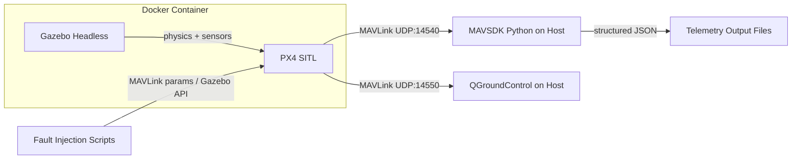

# Phase 1 -- Mission Foundation

> **Objective:** Prove telemetry exists. Get a simulated drone flying, collecting structured telemetry, with the ability to inject faults.

---

## Hardware Constraints

| Spec | Value | Impact |
|------|-------|--------|
| **CPU** | Intel i3-6100U, 2C/4T @ 2.3GHz | Low-power; limits simulation speed |
| **RAM** | 8GB total, ~3.5GB free | Tight; headless mode essential |
| **GPU** | Intel HD 520 integrated | No 3D Gazebo rendering in Docker |
| **OS** | Pop!_OS 22.04, Kernel 6.17 | Good Linux support for Docker |

**Decision:** Run Gazebo in **headless mode** (no GUI rendering). Use **QGroundControl** on the host for 2D map visualization of the drone. This keeps RAM usage manageable and avoids GPU passthrough issues.

---

## What You'll Learn

- How PX4 autopilot works -- the brain of the drone
- How Gazebo simulates physics, sensors, and environment even without visuals
- How MAVSDK lets Python talk to PX4 via MAVLink protocol
- How telemetry flows from sensors -> autopilot -> your code
- How to inject faults to simulate real-world failures
- How QGroundControl visualizes drone state on a 2D map

---

## Architecture Overview



### Key Concepts

| Component | What It Does | Analogy |
|-----------|-------------|---------|
| **PX4 SITL** | Flight controller firmware running in software-in-the-loop mode | The drone's brain, running on your laptop instead of hardware |
| **Gazebo Headless** | Physics simulator without 3D rendering -- still simulates gravity, wind, sensors | A virtual world the drone flies in, you just can't see it directly |
| **MAVLink** | Communication protocol between autopilot and ground systems | The language PX4 speaks |
| **MAVSDK** | Python library that wraps MAVLink into clean async APIs | Your Python translator for talking to PX4 |
| **QGroundControl** | Ground station app -- shows drone on a 2D map, flight data, parameters | Your eyes into the simulation |

---

## Project Directory Structure

```
TARS/
|---- plans/                          # Architecture and planning docs
|   +---- phase-1-mission-foundation.md
|---- docker/                         # Docker setup for PX4 + Gazebo
|   |---- Dockerfile.px4-sitl         # PX4 SITL + Gazebo headless container
|   +---- docker-compose.yml          # Orchestration
|---- src/
|   +---- tars/
|       +---- phase1/
|           |---- __init__.py
|           |---- telemetry_collector.py  # Connects to PX4, streams telemetry
|           |---- mission_runner.py       # Autonomous mission: takeoff -> waypoints -> land
|           |---- fault_injector.py       # Injects GPS drift, wind, battery drain
|           +---- models/
|               |---- __init__.py
|               +---- telemetry.py        # Pydantic models for telemetry data
|---- scripts/
|   |---- start_simulation.sh         # Launch PX4 + Gazebo via Docker
|   +---- run_mission.sh              # Run a complete mission with telemetry
|---- output/                         # Telemetry JSON output files
|---- requirements.txt                # Python dependencies
|---- .env.example                    # Environment variables template
|---- .gitignore
+---- README.md
```

---

## Step-by-Step Build Plan

### Step 1: Docker Environment for PX4 SITL + Gazebo Headless

**What:** Create a Docker container that runs PX4 autopilot in SITL mode with Gazebo running headless -- no GUI.

**Why:** PX4 SITL runs the real PX4 firmware on your computer instead of on drone hardware. Gazebo provides the simulated physics -- gravity, wind, sensors, GPS -- even without rendering 3D graphics. Together they create a fully functional virtual drone that your Python code can control.

**Details:**
- Use the official `px4io/px4-dev-simulation-jammy` base image (Ubuntu 22.04 based)
- Set `HEADLESS=1` environment variable to disable Gazebo GUI rendering
- PX4 SITL exposes MAVLink on UDP ports `14540` (offboard/MAVSDK) and `14550` (QGroundControl)
- Docker Compose maps these ports to the host so your Python scripts and QGroundControl can connect
- Use `host` networking mode for simplest UDP multicast compatibility

**Key ports:**

| Port | Purpose |
|------|---------|
| `14540` | MAVSDK connects here -- offboard API for your Python scripts |
| `14550` | QGroundControl connects here -- visual monitoring on 2D map |

**Expected RAM usage:** ~1.5-2GB for headless Gazebo + PX4 SITL (fits within your ~3.5GB free)

**Success criteria:** `docker compose up` launches PX4 + Gazebo headless, PX4 logs show "Ready for takeoff", and QGroundControl on the host shows the drone on a map.

---

### Step 2: MAVSDK Telemetry Collector

**What:** A Python script that connects to PX4 via MAVSDK and streams real-time telemetry.

**Why:** This is the foundation of everything. If you can't read telemetry, you can't detect anomalies, reason about failures, or learn from missions. This script is the data pipeline that feeds every future phase.

**Details:**
- Uses `mavsdk` Python package (async, built on gRPC internally)
- Connects to PX4 SITL on `udp://:14540`
- Subscribes to telemetry streams: position, battery, GPS info, attitude, flight mode, health
- Outputs structured JSON with ISO 8601 timestamps
- Runs as an async Python service using `asyncio`
- Configurable collection rate (default: 1 Hz to keep output manageable, can increase to 10 Hz)

**Telemetry fields to capture:**

```json
{
  "timestamp": "2024-01-15T10:30:45.123Z",
  "position": {
    "latitude_deg": 47.3977,
    "longitude_deg": 8.5456,
    "absolute_altitude_m": 488.5,
    "relative_altitude_m": 22.3
  },
  "velocity": {
    "north_m_s": 2.1,
    "east_m_s": -0.5,
    "down_m_s": -0.1
  },
  "battery": {
    "voltage_v": 11.8,
    "remaining_percent": 87.0
  },
  "gps": {
    "num_satellites": 12,
    "fix_type": "FIX_3D"
  },
  "attitude": {
    "roll_deg": 2.1,
    "pitch_deg": -1.3,
    "yaw_deg": 145.7
  },
  "flight_mode": "HOLD",
  "health": {
    "is_gyrometer_calibration_ok": true,
    "is_accelerometer_calibration_ok": true,
    "is_magnetometer_calibration_ok": true,
    "is_home_position_ok": true,
    "is_global_position_ok": true
  }
}
```

**Success criteria:** Running the collector while PX4 SITL is active produces a continuous stream of JSON telemetry printed to console and/or saved to file.

---

### Step 3: Autonomous Mission Script

**What:** A Python script that commands the drone through a complete mission: arm -> takeoff -> fly waypoints -> return -> land.

**Why:** You need actual flight data to work with. A stationary drone produces boring, flat telemetry. A mission produces rich, varied data -- altitude changes, heading changes, speed variations, battery drain over time.

**Details:**
- Uses MAVSDK `action` and `mission` plugins
- Mission plan: takeoff to 20m -> fly a square pattern with 4 waypoints -> return to launch -> land
- Runs concurrently with the telemetry collector (two async tasks)
- Waypoints defined relative to the home position (PX4 default: Zurich, Switzerland)
- Includes pre-flight health checks before arming

**Mission profile:**

```
    WP2 -------- WP3
     |            |
     |  ~100m sq  |
     |            |
    WP1 -------- WP4
         HOME
```

**Success criteria:** The drone completes the full mission autonomously. Telemetry shows the complete flight profile -- takeoff, level flight at altitude, turns at waypoints, descent, and landing. QGroundControl shows the flight path on the map.

---

### Step 4: Fault Injection

**What:** Mechanisms to inject realistic faults into the simulation during or before a mission.

**Why:** This is what makes TARS different from a toy project. Real drones face GPS drift, wind gusts, battery degradation, and sensor noise. If you can't simulate these, you can't build detection or reasoning for them in later phases.

**Fault types to implement:**

| Fault | How to Inject | What It Simulates |
|-------|--------------|-------------------|
| **Wind gusts** | Gazebo world file `<wind>` element -- set speed and direction | Sudden weather changes during flight |
| **Battery drain** | PX4 param `BAT_V_EMPTY` / `BAT_N_CELLS` via MAVLink `param set` | Aging battery, cold weather, heavy payload |
| **GPS degradation** | PX4 failure injection: `param set SIM_GPS_BLOCK 1` to block GPS | Satellite signal loss, urban canyon effects |
| **Sensor noise** | Gazebo sensor plugin noise parameters in world/model SDF | Vibration, electromagnetic interference |

**Implementation approach:**
1. **Pre-mission faults** -- Modify Gazebo world file or PX4 params before launch (wind, sensor noise)
2. **Runtime faults** -- Use MAVSDK `param` plugin to change PX4 parameters mid-flight (battery, GPS block)
3. **Scripted fault scenarios** -- Python scripts that trigger faults at specific mission phases

**PX4 built-in failure simulation parameters (key ones):**
- `SIM_GPS_BLOCK` -- blocks GPS signal
- `SIM_GPS_NOISE` -- adds noise to GPS readings  
- `SIM_BARO_OFF` -- barometer offset
- `SIM_MAG_OFFSET_X/Y/Z` -- magnetometer offsets
- Battery params can simulate faster drain

**Success criteria:** You can trigger each fault type and observe its effect in the telemetry stream. For example: enable `SIM_GPS_BLOCK` mid-flight and see GPS fix degrade in telemetry, or add wind and see attitude/velocity changes.

---

### Step 5: Structured Telemetry Output

**What:** Save all telemetry from a mission run into a structured JSON file with metadata.

**Why:** This is the input for Phase 2 -- Mission Replay. Without structured, timestamped output, replay is impossible. This also becomes the training data for the incident engine in Phase 4.

**Output format:**

```json
{
  "mission_id": "mission_001",
  "start_time": "2024-01-15T10:30:00Z",
  "end_time": "2024-01-15T10:35:42Z",
  "drone_id": "tars-sim-01",
  "faults_injected": ["gps_block_at_120s", "wind_5ms_north"],
  "telemetry": [
    { "timestamp": "...", "position": {}, "battery": {}, "gps": {}, "attitude": {}, "flight_mode": "...", "health": {} },
    { "timestamp": "...", "position": {}, "battery": {}, "gps": {}, "attitude": {}, "flight_mode": "...", "health": {} }
  ],
  "mission_result": "SUCCESS",
  "summary": {
    "total_events": 342,
    "duration_seconds": 342,
    "max_altitude_m": 22.5,
    "distance_traveled_m": 450.2,
    "min_battery_percent": 81.2,
    "collection_rate_hz": 1
  }
}
```

**Success criteria:** After a mission, a complete JSON file exists in `output/` that captures the entire flight with all telemetry events, metadata, and a summary.

---

## Dependencies

### Python (host machine -- Python 3.10+)
```
mavsdk>=2.0.0        # Async drone control via MAVLink
pydantic>=2.0.0      # Data validation and JSON serialization
```

### Docker
- Docker Engine 24+
- Docker Compose v2
- ~8-10GB disk space for PX4 SITL image (one-time download)

### QGroundControl (host machine -- optional but recommended)
- Download AppImage from https://docs.qgroundcontrol.com/master/en/qgc-user-guide/getting_started/download_and_install.html
- Connects automatically to UDP port 14550
- Shows drone position on 2D map, telemetry gauges, flight mode

---

## Phase 1 Success Criteria -- Definition of Done

1. [x] `docker compose up` launches PX4 SITL + Gazebo headless with no manual intervention
2. [x] QGroundControl on host connects and shows the drone on a 2D map
3. [x] Telemetry collector connects and streams structured JSON telemetry
4. [x] Mission script flies the drone through a complete waypoint mission
5. [x] At least 3 fault types can be injected and their effects observed in telemetry
6. [x] Complete mission telemetry is saved as a structured JSON file in `output/`
7. [x] You can say: "Show me the telemetry from mission X" and produce the JSON

---

## What This Enables -- Looking Ahead

Phase 1 output feeds directly into:
- **Phase 2 -- Mission Replay:** The JSON files become replayable mission records stored in PostgreSQL
- **Phase 3 -- State Engine:** Raw telemetry becomes the input for state computation via Redis
- **Phase 4 -- Incident Engine:** Fault injection data trains the incident detector

---

## Key Learning Moments

As you build Phase 1, pay attention to:

1. **MAVLink is chatty** -- PX4 sends hundreds of messages per second. You'll learn why Phase 4's incident engine -- collapsing 500 events into 1 incident -- matters.
2. **Simulation is not reality** -- Gazebo physics are approximate. Real drones have vibration, flex, and electromagnetic interference that simulators can't fully replicate. This is why the architecture keeps the LLM on the analysis path, not the control path.
3. **Async is essential** -- Telemetry streams are concurrent. You'll use `asyncio` heavily, which prepares you for the event-driven architecture in later phases.
4. **Fault injection is an art** -- Making faults realistic enough to be useful but controlled enough to be reproducible is a core skill for building robust autonomous systems.
5. **Headless is production** -- Most real drone testing pipelines run headless. You're learning the production pattern, not the demo pattern.
