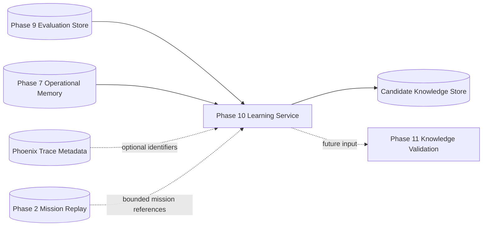

# Phase 10 -- Learning Engine

> **Objective:** Turn evaluated mission history into candidate operational
> knowledge.
>
> Phase 10 answers "What pattern appears to be supported by repeated evaluated
> outcomes?" It creates candidate learning with evidence, confidence, and
> provenance. It does not validate that knowledge or use it to change
> recommendations yet.

---

## Product Context

Existing drone platforms monitor missions. TARS is designed to learn from
missions.

Phases 1 through 9 create the evidence needed for learning:

- Phase 2 stores replayable mission history.
- Phase 4 creates deterministic incident records.
- Phase 5 produces advisory root-cause reasoning and recommendations.
- Phase 6 traces reasoning execution in Phoenix.
- Phase 7 connects missions, incidents, root causes, mitigations, and outcomes
  in Neo4j operational memory.
- Phase 8 gives the reasoning agent bounded trace introspection.
- Phase 9 measures reasoning quality against ground-truth labels, mission
  outcomes, incident facts, and consistency signals.

Phase 10 aggregates this evidence into candidate knowledge. The platform can
now ask:

```text
Across evaluated missions, what root-cause, mitigation, and outcome patterns
appear reliable enough to propose for validation?
```

Candidate knowledge is not truth. It is a structured hypothesis backed by
auditable evidence.

Example:

```text
For navigation_instability incidents with gps_interference root cause,
switch_to_visual_odometry was associated with recovered or stabilized outcomes
in 91% of evaluated cases.
```

This becomes the input to Phase 11 validation, not a direct recommendation.

---

## Scope

Phase 10 introduces a learning service that mines Phase 9 evaluation records,
Phase 7 operational memory, and safe trace metadata for repeated patterns.

Phase 10 owns:

- Learning configuration and thresholds.
- Candidate knowledge request and response models.
- Evidence aggregation across evaluated missions and incidents.
- Pattern mining for root-cause, mitigation, outcome, and reasoning-quality
  relationships.
- Candidate confidence scoring.
- Candidate persistence with provenance.
- Deduplication and versioning of candidate knowledge.
- API endpoints for learning runs, candidate lookup, and candidate lifecycle
  status.
- Tests proving learning is bounded, explainable, non-adaptive, and does not
  promote knowledge automatically.

Phase 10 should answer:

- "Which mitigations repeatedly worked for a root cause?"
- "Which root-cause predictions were consistently correct for a given incident
  family?"
- "Which recommendations were repeatedly associated with poor outcomes?"
- "Which false positives or false negatives form a recurring failure pattern?"
- "Which Phoenix trace or prompt versions are correlated with low evaluation
  quality?"
- "What evidence supports this candidate learning?"
- "Has this candidate already been proposed before?"

---

## Success Statement

Phase 10 succeeds when a bounded learning run can aggregate evaluated mission
history and persist candidate knowledge with clear evidence, confidence,
limitations, and provenance, without changing Phase 5 behavior or promoting
validated knowledge.

```text
Evaluation records + operational memory + safe trace metadata
    -> Learning service
    -> repeated pattern detection
    -> candidate knowledge with evidence bundle
    -> persisted candidate record
    -> future input to Phase 11 validation
```

An operator should be able to inspect exactly which missions, incidents,
evaluations, outcomes, and trace identifiers support a candidate.

---

## Non-Goals

Phase 10 must not:

- Promote candidate knowledge into validated knowledge; that belongs to
  Phase 11.
- Use candidate knowledge to adapt recommendations; that belongs to Phase 12.
- Automatically modify Phase 5 prompts, tools, model settings, or system
  instructions.
- Call PX4, MAVSDK, or any flight-control interface.
- Invoke Gemini or any LLM to create learning claims.
- Treat a single evaluation as learning.
- Treat Phase 9 evaluation scores as automatic truth.
- Treat correlation as causation.
- Store raw telemetry, full Phoenix traces, prompts, responses, credentials, or
  unbounded mission timelines.
- Make Phoenix, Gemini, Neo4j, or a live simulator required for unit tests.
- Block reasoning, evaluation, replay, state processing, or incident detection
  when learning is unavailable.

Phase 10 proposes what the system may have learned. It does not decide that the
learning is valid.

---

## Architecture



### Runtime Boundary

```text
Flight-critical path:
PX4 -> telemetry -> state -> deterministic incident detection

Analysis path:
evaluations + outcomes + memory graph -> learning -> candidate knowledge
```

Phase 10 runs asynchronously after evaluation data exists. It is not part of
control, state classification, incident detection, reasoning generation, or
evaluation scoring.

### Component Responsibilities

| Component | Responsibility |
|-----------|----------------|
| **Learning Config** | Load thresholds, batch limits, source URLs, scoring weights, and store settings. |
| **Learning Models** | Define learning-run, evidence, pattern, and candidate knowledge schemas. |
| **Evaluation Adapter** | Read Phase 9 evaluation summaries and metric labels. |
| **Memory Adapter** | Read Phase 7 incident neighborhoods, mitigations, outcomes, and similar history. |
| **Trace Metadata Adapter** | Attach safe Phoenix trace identifiers and execution metadata only. |
| **Pattern Miner** | Group evaluated cases into candidate patterns. |
| **Candidate Scorer** | Compute support count, success rate, evidence strength, and confidence. |
| **Learning Repository** | Persist learning runs, candidate knowledge, evidence links, and dedupe keys. |
| **API Layer** | Provide health, run learning, list candidates, get candidate, and retire candidate endpoints. |

---

## Source-of-Truth Boundaries

| Data | Source of Truth | Phase 10 Behavior |
|------|-----------------|-------------------|
| Mission events | Phase 2 PostgreSQL | Reference mission IDs and bounded mission metadata only. |
| Incident facts | Phase 4 / Phase 7 | Consume incident IDs, types, severity, and deterministic classifications through existing services. |
| Reasoning results | Phase 5 Redis / Phase 7 projection | Use reasoning IDs, root causes, recommendations, prompt versions, and model metadata; do not invoke reasoning. |
| Reasoning traces | Phoenix | Reference trace IDs and safe metadata only; do not copy trace bodies. |
| Operational outcomes | Phase 7 Neo4j | Read mitigation and outcome relationships as evidence. |
| Evaluation records | Phase 9 store | Primary measured quality input for learning. |
| Candidate knowledge | Phase 10 store | Own proposed patterns, confidence, evidence, and lifecycle status. |
| Validated knowledge | Future Phase 11 | Not created by Phase 10. |

Candidate knowledge records are durable product data. They must be inspectable
even when Phoenix or Neo4j is temporarily unavailable.

---

## Learning Contract

All candidate learning must be bounded, explainable, versioned, and advisory.

### Candidate Types

| Type | Meaning | Example |
|------|---------|---------|
| `mitigation_effectiveness` | A mitigation is associated with successful outcomes for a root cause or incident family. | Visual odometry fallback frequently recovers GPS drift incidents. |
| `root_cause_pattern` | A root cause repeatedly appears for a deterministic incident family. | Navigation instability often maps to GPS interference under high wind. |
| `reasoning_quality_pattern` | A reasoning condition correlates with strong or weak evaluation scores. | Prompt version X has low recommendation accuracy for battery incidents. |
| `false_positive_pattern` | A repeated unsupported incident or reasoning claim appears. | Wind escalation was often over-reported when battery sag was primary. |
| `false_negative_pattern` | A repeated missed incident or root cause appears. | Sensor-lag cases often missed localization failure. |
| `risk_context_pattern` | Mission context is repeatedly associated with degraded or failed outcomes. | Low GPS quality plus altitude oscillation predicts navigation instability. |

### Candidate Statuses

```text
proposed
superseded
retired
rejected
```

Phase 10 should normally create `proposed` candidates. It may retire or
supersede its own candidates when a later learning run finds contradictory or
stronger evidence. It must not create a `validated` status.

### Evidence Strength

```text
operator_label
mission_outcome
deterministic_incident
evaluation_metric
operational_memory
trace_metadata
```

Evidence strength must prefer labels, outcomes, deterministic incident facts,
and evaluation metrics over trace metadata. Trace metadata can explain where a
candidate came from, but it cannot by itself support an operational learning
claim.

### Minimum Learning Rules

Initial conservative defaults:

| Rule | Default |
|------|---------|
| Minimum evaluated cases per candidate | `5` |
| Minimum distinct missions | `3` |
| Minimum evidence score | `0.60` |
| Minimum success rate for positive mitigation candidates | `0.70` |
| Maximum false-positive rate for positive candidates | `0.20` |
| Minimum contradiction cases to flag as weak | `2` |

These Phase 10 thresholds are intentionally lower than Phase 11 validation
thresholds. Phase 11 can require stronger rules such as `observed > 20` and
`success_rate > 0.80`.

---

## Candidate Data Model

### `LearningRunRequest`

```json
{
  "mission_ids": ["mission_20260618_120000"],
  "incident_family": "navigation_instability",
  "root_cause": "gps_interference",
  "candidate_types": ["mitigation_effectiveness"],
  "since": "2026-06-01T00:00:00Z",
  "until": "2026-06-21T00:00:00Z",
  "min_evaluated_cases": 5,
  "dry_run": false
}
```

Rules:

- `mission_ids`, `incident_family`, and `root_cause` are optional filters.
- `candidate_types` defaults to all supported candidate types.
- `dry_run=true` returns candidates without persistence.
- Date ranges must be bounded by configuration.

### `LearningEvidence`

```json
{
  "evidence_id": "ev_abc123",
  "mission_id": "mission_20260618_120000",
  "incident_id": "inc_abc123",
  "reasoning_id": "reason_abc123",
  "evaluation_id": "eval_abc123",
  "trace_id": "trace_abc123",
  "root_cause": "gps_interference",
  "mitigation": "switch_to_visual_odometry",
  "outcome": "recovered",
  "overall_score": 0.91,
  "metric_labels": {
    "root_cause_accuracy": "correct",
    "recommendation_accuracy": "correct"
  },
  "evidence_levels": ["mission_outcome", "evaluation_metric", "operational_memory"]
}
```

Rules:

- Evidence must carry identifiers, not unbounded source payloads.
- Metric labels are allowed; raw explanations should be summarized and bounded.
- Trace IDs are allowed; trace bodies are not.

### `CandidateKnowledge`

```json
{
  "candidate_id": "cand_abc123",
  "candidate_type": "mitigation_effectiveness",
  "status": "proposed",
  "statement": "switch_to_visual_odometry is associated with recovered or stabilized outcomes for gps_interference navigation_instability incidents.",
  "incident_family": "navigation_instability",
  "root_cause": "gps_interference",
  "mitigation": "switch_to_visual_odometry",
  "outcome_family": "recovered_or_stabilized",
  "support_count": 11,
  "contradiction_count": 1,
  "distinct_mission_count": 9,
  "success_rate": 0.91,
  "mean_overall_score": 0.86,
  "confidence": 0.78,
  "evidence_ids": ["ev_abc123", "ev_def456"],
  "source_evaluation_ids": ["eval_abc123", "eval_def456"],
  "source_trace_ids": ["trace_abc123"],
  "learning_version": "phase10.v1",
  "dedupe_key": "mitigation_effectiveness:navigation_instability:gps_interference:switch_to_visual_odometry",
  "created_at": "2026-06-21T00:00:00Z",
  "advisory_only": true
}
```

Rules:

- `statement` must be generated by deterministic templates.
- `confidence` must be bounded `[0.0, 1.0]`.
- `advisory_only` must always be `true`.
- `dedupe_key` must be deterministic and stable.
- Candidate records must include enough IDs to audit their evidence.

### `LearningRunResponse`

```json
{
  "run_id": "learnrun_abc123",
  "status": "complete",
  "started_at": "2026-06-21T00:00:00Z",
  "completed_at": "2026-06-21T00:00:03Z",
  "filters": {
    "incident_family": "navigation_instability"
  },
  "evaluated_cases_read": 24,
  "evidence_items_used": 18,
  "candidates_proposed": 2,
  "candidates_updated": 1,
  "candidates_suppressed": 4,
  "candidate_ids": ["cand_abc123", "cand_def456"],
  "warnings": []
}
```

---

## Confidence Scoring

Phase 10 confidence is not validation. It is a ranking signal for candidate
review and Phase 11 eligibility.

Suggested initial scoring:

```text
confidence =
    0.35 * support_strength
  + 0.25 * outcome_strength
  + 0.20 * evaluation_quality
  + 0.10 * evidence_diversity
  + 0.10 * contradiction_penalty_adjusted
```

Where:

- `support_strength` increases with support count and distinct mission count.
- `outcome_strength` uses success rate for positive mitigation candidates or
  recurrence rate for failure-pattern candidates.
- `evaluation_quality` uses mean Phase 9 overall score and metric labels.
- `evidence_diversity` rewards evidence across multiple missions, incidents,
  and sources.
- `contradiction_penalty_adjusted` decreases as contradiction count or false
  positive rate rises.

All scoring formulas must be versioned. Future changes should create a new
`learning_version` rather than silently changing old candidates.

---

## Pattern Mining

### Mitigation Effectiveness

Group evaluated cases by:

```text
incident_family + root_cause + mitigation
```

Positive support:

- Outcome is `recovered` or `stabilized`.
- Recommendation accuracy is `correct` or `partially_correct`.
- Overall evaluation score is above threshold.

Contradiction:

- Outcome is `failed` or persistently `degraded`.
- Recommendation accuracy is `incorrect`.
- False-positive signal applies to the incident or reasoning.

### Root-Cause Pattern

Group evaluated cases by:

```text
incident_family + accepted_root_cause
```

Support:

- Root-cause accuracy is `correct` or `partially_correct`.
- Ground truth source is operator label, mission outcome, deterministic rule, or
  accepted memory outcome.

Output:

- Candidate pattern describing recurring root cause for an incident family and
  optional context filters.

### Reasoning Quality Pattern

Group evaluated cases by:

```text
model + prompt_version + incident_family + metric_name
```

Support:

- Repeated low or high metric labels for a bounded reasoning configuration.
- Trace metadata references only IDs and execution attributes.

Output:

- Candidate describing recurring reasoning-quality behavior.
- This is still candidate knowledge, not automatic prompt tuning.

### False-Positive / False-Negative Pattern

Group evaluated cases by:

```text
incident_family + predicted_root_cause + context bucket
```

Support:

- Repeated Phase 9 false-positive or false-negative labels.
- Distinct missions and bounded deterministic incident facts.

Output:

- Candidate describing a repeated detection or reasoning gap.

---

## API Contract

Base path:

```text
/api/v1/learning
```

### Endpoints

| Method | Path | Purpose |
|--------|------|---------|
| `GET` | `/health` | API, store, and optional dependency readiness. |
| `POST` | `/api/v1/learning/runs` | Start a bounded learning run. |
| `GET` | `/api/v1/learning/runs/{run_id}` | Fetch run status and summary. |
| `GET` | `/api/v1/learning/candidates` | List candidate knowledge with filters. |
| `GET` | `/api/v1/learning/candidates/{candidate_id}` | Fetch one candidate with evidence summary. |
| `GET` | `/api/v1/learning/candidates/{candidate_id}/evidence` | Fetch bounded evidence items. |
| `POST` | `/api/v1/learning/candidates/{candidate_id}/retire` | Retire a candidate with a reason. |

### API Rules

- All candidate responses must include `advisory_only=true`.
- Evidence endpoints must be paginated.
- Large learning runs must be bounded by config.
- Dependency outages should degrade the run when possible and record warnings.
- Dry runs must not write candidate records.

---

## Storage Plan

Phase 10 should use PostgreSQL for durable candidate knowledge and learning run
metadata.

### Tables

#### `learning_runs`

Fields:

- `run_id`
- `status`
- `filters_json`
- `learning_version`
- `evaluated_cases_read`
- `evidence_items_used`
- `candidates_proposed`
- `candidates_updated`
- `candidates_suppressed`
- `warnings_json`
- `started_at`
- `completed_at`
- `error_code`
- `error_message`

#### `candidate_knowledge`

Fields:

- `candidate_id`
- `candidate_type`
- `status`
- `statement`
- `incident_family`
- `root_cause`
- `mitigation`
- `outcome_family`
- `support_count`
- `contradiction_count`
- `distinct_mission_count`
- `success_rate`
- `mean_overall_score`
- `confidence`
- `learning_version`
- `dedupe_key`
- `supersedes_candidate_id`
- `advisory_only`
- `created_at`
- `updated_at`

Indexes:

- Unique index on `dedupe_key`, `learning_version`, and active status.
- Index on `candidate_type`.
- Index on `incident_family`.
- Index on `root_cause`.
- Index on `confidence`.
- Index on `status`.

#### `candidate_evidence`

Fields:

- `evidence_id`
- `candidate_id`
- `mission_id`
- `incident_id`
- `reasoning_id`
- `evaluation_id`
- `trace_id`
- `root_cause`
- `mitigation`
- `outcome`
- `overall_score`
- `metric_labels_json`
- `evidence_levels_json`
- `created_at`

Indexes:

- Index on `candidate_id`.
- Index on `mission_id`.
- Index on `incident_id`.
- Index on `evaluation_id`.
- Index on `trace_id`.

#### `learning_run_candidates`

Fields:

- `run_id`
- `candidate_id`
- `action`
- `created_at`

Actions:

```text
proposed
updated
suppressed
unchanged
```

---

## Configuration

Suggested environment variables:

| Variable | Default | Purpose |
|----------|---------|---------|
| `LEARNING_ENABLED` | `true` | Enable the Phase 10 service. |
| `LEARNING_DATABASE_URL` | `postgresql+asyncpg://.../tars_learning` | Candidate knowledge store. |
| `LEARNING_VERSION` | `phase10.v1` | Version for scoring and candidate generation. |
| `LEARNING_MIN_EVALUATED_CASES` | `5` | Minimum support count for a candidate. |
| `LEARNING_MIN_DISTINCT_MISSIONS` | `3` | Minimum distinct missions for a candidate. |
| `LEARNING_MIN_CONFIDENCE` | `0.60` | Minimum confidence to persist a proposed candidate. |
| `LEARNING_MIN_SUCCESS_RATE` | `0.70` | Minimum success rate for positive mitigation candidates. |
| `LEARNING_MAX_FALSE_POSITIVE_RATE` | `0.20` | Suppress positive candidates above this false-positive rate. |
| `LEARNING_BATCH_LIMIT` | `100` | Maximum evaluations read per bounded run. |
| `LEARNING_EVIDENCE_PAGE_SIZE` | `50` | Default evidence page size. |
| `PHASE9_API_URL` | `http://localhost:8006` | Evaluation API URL. |
| `PHASE7_API_URL` | `http://localhost:8005` | Operational memory API URL. |
| `PHOENIX_BASE_URL` | `http://localhost:6006` | Optional trace metadata source. |
| `LEARNING_TRACE_METADATA_ENABLED` | `false` | Include safe trace metadata when available. |

Configuration validation should ensure:

- Minimum counts are positive.
- All rates and weights are bounded `[0.0, 1.0]`.
- Scoring weights sum to `1.0`.
- Batch and page limits are bounded.

---

## Proposed File Structure

```text
src/tars/phase10/
    __init__.py
    api.py
    config.py
    database.py
    models.py
    repository.py
    service.py
    evidence_loader.py
    pattern_miner.py
    scorer.py
    statement_templates.py
    adapters/
        __init__.py
        phase7_client.py
        phase9_client.py
        phoenix_client.py

tests/phase10/
    __init__.py
    conftest.py
    test_config.py
    test_models.py
    test_evidence_loader.py
    test_pattern_miner.py
    test_scorer.py
    test_repository.py
    test_service.py
    test_api.py

migrations/versions/010_create_phase10_learning_tables.py
scripts/start_learning_api.sh
```

---

## Implementation Plan

### Step 1 -- Define Contracts

- Create `src/tars/phase10/config.py`.
- Add bounded settings and validation.
- Create `src/tars/phase10/models.py`.
- Define:
  - `CandidateType`
  - `CandidateStatus`
  - `LearningRunStatus`
  - `EvidenceLevel`
  - `LearningRunRequest`
  - `LearningEvidence`
  - `CandidateKnowledge`
  - `LearningRunResponse`
  - list and detail response schemas
  - health response schema

Acceptance:

- Models reject unbounded scores, confidence values, and invalid statuses.
- Candidate responses always carry `advisory_only=True`.
- Statements and notes are truncated and secret-redacted.

### Step 2 -- Add Persistence

- Create migration `010_create_phase10_learning_tables.py`.
- Add `database.py` using the same async SQLAlchemy style as Phase 9.
- Add `repository.py` for:
  - creating learning runs
  - completing or failing learning runs
  - upserting candidate knowledge by dedupe key
  - storing candidate evidence
  - listing candidates by filters
  - fetching one candidate and paginated evidence
  - retiring candidates

Acceptance:

- Persistence is idempotent for repeated runs with the same candidate key.
- Candidate evidence is queryable by candidate and evaluation IDs.
- Repository tests run without live external services.

### Step 3 -- Build Adapters

- Add Phase 9 adapter for evaluation summaries.
- Add Phase 7 adapter for incident memory and outcome context.
- Add optional Phoenix adapter for trace metadata only.

Acceptance:

- Phase 9 is required for meaningful learning runs.
- Phase 7 and Phoenix outages produce warnings where possible, not crashes.
- Adapters never fetch raw prompts, responses, full traces, or raw telemetry.

### Step 4 -- Evidence Loader

- Create `evidence_loader.py`.
- Merge Phase 9 evaluation summaries with Phase 7 operational context.
- Normalize root causes, mitigations, outcomes, and incident families.
- Emit bounded `LearningEvidence` records.

Acceptance:

- Evidence records contain identifiers and bounded metadata only.
- Missing optional context lowers evidence strength instead of inventing facts.
- Duplicate evaluations do not double-count evidence.

### Step 5 -- Pattern Miner

- Create `pattern_miner.py`.
- Implement deterministic grouping for:
  - mitigation effectiveness
  - root-cause patterns
  - reasoning-quality patterns
  - false-positive patterns
  - false-negative patterns
  - risk-context patterns if enough context exists

Acceptance:

- Patterns below support thresholds are suppressed with reasons.
- Contradictions are counted separately from support.
- Pattern outputs are deterministic for the same evidence input.

### Step 6 -- Candidate Scorer

- Create `scorer.py`.
- Implement versioned confidence scoring.
- Compute:
  - support count
  - contradiction count
  - distinct mission count
  - success rate
  - mean overall score
  - confidence
  - suppression reasons

Acceptance:

- Scores are bounded `[0.0, 1.0]`.
- Low support, high contradiction, and poor evaluation quality lower confidence.
- Formula changes require a new `LEARNING_VERSION`.

### Step 7 -- Statement Templates

- Create `statement_templates.py`.
- Generate candidate statements from deterministic templates.
- Avoid causal language unless Phase 11 later validates causality.

Preferred wording:

```text
is associated with
appears repeatedly with
was observed alongside
```

Avoid:

```text
causes
fixes
guarantees
proves
```

Acceptance:

- Statements are bounded and deterministic.
- Candidate claims do not overstate evidence.

### Step 8 -- Learning Service

- Create `service.py`.
- Orchestrate:
  1. create learning run
  2. load bounded evidence
  3. mine patterns
  4. score candidates
  5. persist or dry-run candidates
  6. update run status and warnings

Acceptance:

- `dry_run=true` performs no candidate writes.
- Partial dependency failures are captured as warnings.
- Failed runs record error code and message.

### Step 9 -- API

- Create `api.py`.
- Expose health, run, candidate list/detail, evidence, and retire endpoints.
- Use dependency injection for repository and clients, matching Phase 9 test
  style.

Acceptance:

- API tests run with fake adapters and repository.
- Disabled service returns `503`.
- Health reports PostgreSQL, Phase 9, Phase 7, and Phoenix metadata status.

### Step 10 -- Scripts And Documentation

- Add `scripts/start_learning_api.sh`.
- Update README with:
  - architecture table entry
  - source tree entry
  - start instructions
  - example learning run
  - environment variables
  - test commands

Acceptance:

- Operator can start Phase 10 on a new port, likely `8007`.
- README clearly says Phase 10 creates candidate knowledge only.

---

## Testing Plan

Unit tests should not require PostgreSQL, Phoenix, Gemini, Neo4j, PX4, or a live
simulator unless explicitly marked as integration tests.

### Required Test Areas

| Test File | Coverage |
|-----------|----------|
| `test_config.py` | Defaults, env overrides, weight validation, bounded limits. |
| `test_models.py` | Schema validation, enum constraints, advisory-only behavior, secret redaction. |
| `test_evidence_loader.py` | Evaluation-memory merge, dedupe, missing context, bounded evidence. |
| `test_pattern_miner.py` | Deterministic grouping, support/contradiction counting, suppression reasons. |
| `test_scorer.py` | Confidence bounds, success-rate math, contradiction penalties, versioning. |
| `test_repository.py` | Run persistence, candidate upsert, evidence pagination, retire flow. |
| `test_service.py` | End-to-end learning orchestration with fakes and dry-run behavior. |
| `test_api.py` | Health, run creation, candidate lookup, evidence lookup, disabled service. |

### Regression Tests

- Phase 9 tests must continue passing.
- Phase 7 tests must continue passing.
- Phase 10 must not import Phase 5 provider code or invoke Gemini.
- Phase 10 must not call any flight-control package.

Suggested commands:

```bash
PYTHONPATH=src .venv/bin/pytest tests/phase10 -q
PYTHONPATH=src .venv/bin/pytest tests/phase7 tests/phase9 tests/phase10 -q
```

---

## Acceptance Criteria

1. Phase 10 exposes a learning API with health, run, candidate lookup, evidence
   lookup, and retire endpoints.
2. Learning runs aggregate Phase 9 evaluation records into bounded evidence.
3. Candidate knowledge is generated only from repeated evaluated patterns.
4. Candidate confidence is bounded, deterministic, versioned, and explainable.
5. Candidate records include mission, incident, reasoning, evaluation, and trace
   identifiers where available.
6. Candidate statements use cautious association language and deterministic
   templates.
7. Duplicate candidates are deduped by stable keys.
8. Dry runs do not persist candidate knowledge.
9. Phase 7 and Phoenix are optional where possible; their outages produce
   warnings instead of unbounded failure.
10. Phase 10 never creates validated knowledge, changes recommendations, invokes
    Gemini, or touches flight-control interfaces.
11. All Phase 10 tests run without live PX4, Phoenix, Gemini, Neo4j, or upstream
    APIs.
12. Phase 7, Phase 9, and Phase 10 test suites pass together.

---

## Phase 11 Handoff

Phase 10 produces proposed candidate knowledge. Phase 11 decides whether any
candidate is valid enough to become operational knowledge.

Phase 11 can consume:

- Candidate statement and type.
- Candidate confidence.
- Support and contradiction counts.
- Distinct mission count.
- Success rate and mean evaluation score.
- Candidate evidence records.
- Source evaluation, mission, incident, reasoning, and trace IDs.
- Learning version and dedupe key.

Phase 11 must treat Phase 10 candidates as hypotheses, not truth. It should
validate them against stricter thresholds, operator review, temporal holdout
sets, and contradiction checks before creating validated knowledge.
