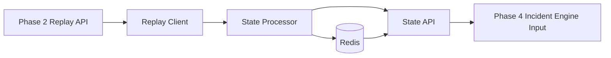

# Phase 3 -- State Engine

> **Objective:** Transform raw telemetry into operational state.
> Phase 1 proves telemetry exists. Phase 2 makes telemetry replayable. Phase 3 turns replay frames into the current mission state that later incident detection can consume.

---

## Scope

Phase 3 is a deterministic state computation layer.

It should answer:

- "What phase is this mission currently in?"
- "Is the drone healthy, degraded, or critical?"
- "What is the current risk score?"
- "What state did mission X have at replay time T?"
- "Can Phase 4 consume a clean state stream instead of raw telemetry?"

Phase 3 should not detect incidents, call Gemini, trace with Phoenix, write to Neo4j, or make recommendations. Those belong to later phases.

---

## Phase 2 Handoff

Phase 2 exposes ordered replay frames:

```json
{
  "mission_id": "mission_20260608_120000",
  "speed": 1.0,
  "frames": [
    {
      "sequence": 0,
      "elapsed_ms": 0,
      "timestamp": "2026-06-08T06:30:00Z",
      "telemetry": {
        "position": {},
        "velocity": {},
        "battery": {},
        "gps": {},
        "attitude": {},
        "flight_mode": "MISSION",
        "health": {}
      }
    }
  ]
}
```

Phase 3 consumes those frames and produces state snapshots:

```json
{
  "mission_id": "mission_20260608_120000",
  "sequence": 42,
  "elapsed_ms": 42000,
  "phase": "cruise",
  "health": "degraded",
  "risk": 0.63,
  "signals": {
    "gps_quality": "weak",
    "battery_level": "normal",
    "altitude_stability": "stable",
    "attitude_stability": "elevated"
  }
}
```

---

## Architecture Overview



### Components

| Component | Responsibility |
|-----------|----------------|
| **Replay Client** | Fetch ordered frames from Phase 2 replay endpoints. |
| **State Processor** | Convert telemetry frames into state snapshots. |
| **Redis Store** | Keep current mission state and replay state streams with low-latency access. |
| **State API** | Start replay processing and query computed state. |
| **Rules** | Deterministic phase, health, signal, and risk calculations. |

---

## Package Layout

Add a new package:

```
src/
+-- tars/
    +-- phase3/
        |-- __init__.py
        |-- api.py
        |-- config.py
        |-- models.py
        |-- phase_classifier.py
        |-- replay_client.py
        |-- risk.py
        |-- service.py
        |-- state_processor.py
        +-- store.py
```

Responsibilities:

- `config.py`: Redis URL, Phase 2 API URL, state TTLs.
- `models.py`: Pydantic models for telemetry input and state output.
- `replay_client.py`: HTTP client for Phase 2 replay frames.
- `phase_classifier.py`: mission phase classification rules.
- `risk.py`: health, signal, and risk score calculations.
- `state_processor.py`: frame-to-state orchestration.
- `store.py`: Redis reads/writes.
- `service.py`: application service for processing and querying.
- `api.py`: FastAPI routes for state processing and state lookup.

---

## Redis Key Design

Redis is an operational state store, not the historical source of truth. PostgreSQL remains the durable mission history.

### Current State

```
tars:mission:{mission_id}:state:current
```

Type: string JSON

Contains the latest state snapshot for a mission.

### State Timeline

```
tars:mission:{mission_id}:state:timeline
```

Type: sorted set

- score: `elapsed_ms`
- value: compact JSON state snapshot

This lets the API answer "state at time T" with `ZRANGEBYSCORE`.

### Processing Metadata

```
tars:mission:{mission_id}:state:meta
```

Type: hash

Fields:

- `status`: `not_started`, `processing`, `complete`, `failed`
- `frames_processed`
- `started_at`
- `completed_at`
- `error`

Recommended TTL for local development: no TTL by default. Add optional TTL later if memory becomes noisy.

---

## State Model

### Enums

Mission phase:

- `preflight`
- `takeoff`
- `climb`
- `cruise`
- `return_to_launch`
- `landing`
- `landed`
- `unknown`

Health:

- `nominal`
- `degraded`
- `critical`
- `unknown`

Signal quality:

- `normal`
- `weak`
- `unstable`
- `missing`

### `StateSnapshot`

```json
{
  "mission_id": "mission_20260608_120000",
  "sequence": 42,
  "timestamp": "2026-06-08T06:30:42Z",
  "elapsed_ms": 42000,
  "phase": "cruise",
  "health": "degraded",
  "risk": 0.63,
  "signals": {
    "gps_quality": "weak",
    "battery_level": "normal",
    "altitude_stability": "stable",
    "attitude_stability": "elevated"
  },
  "metrics": {
    "relative_altitude_m": 21.4,
    "ground_speed_m_s": 5.1,
    "battery_percent": 72.0,
    "gps_satellites": 5,
    "roll_abs_deg": 9.2,
    "pitch_abs_deg": 4.8
  },
  "reasons": [
    "gps satellites below nominal threshold",
    "attitude elevated while in cruise"
  ]
}
```

---

## State Computation Rules

Keep Phase 3 rules simple, deterministic, and explainable. They are not incident detection yet; they only summarize operational state.

### Mission Phase

Initial rules:

| Condition | Phase |
|-----------|-------|
| no position or no flight mode | `unknown` |
| `flight_mode` contains `HOLD` and altitude < 1m | `preflight` |
| altitude rising from < 2m to >= 2m | `takeoff` |
| altitude rising and altitude < target cruise band | `climb` |
| altitude >= 10m and flight mode contains `MISSION` | `cruise` |
| flight mode contains `RETURN` or `RTL` | `return_to_launch` |
| altitude decreasing and altitude < 10m | `landing` |
| altitude < 0.5m and not in air if available | `landed` |

Because Phase 1 snapshots do not currently include `in_air`, phase classification should work without it.

### Health

Initial rules:

| Condition | Health |
|-----------|--------|
| missing core telemetry | `unknown` |
| battery < 15% | `critical` |
| GPS fix is `NO_GPS` or `NO_FIX` during non-preflight phase | `critical` |
| any core health flag false during flight | `critical` |
| battery < 30% | `degraded` |
| GPS satellites < 6 during flight | `degraded` |
| absolute roll or pitch > 20 deg in cruise | `degraded` |
| otherwise | `nominal` |

### Risk Score

Risk is a normalized `0.0` to `1.0` score.

Start with additive weights:

| Signal | Weight |
|--------|--------|
| GPS missing/no fix | `+0.45` |
| GPS satellites < 6 | `+0.20` |
| battery < 15% | `+0.40` |
| battery < 30% | `+0.20` |
| health flag false | `+0.35` |
| roll or pitch > 20 deg | `+0.20` |
| vertical speed high near ground | `+0.20` |
| missing telemetry field | `+0.10` |

Clamp final score to `1.0`.

Risk categories:

- `0.00-0.29`: nominal
- `0.30-0.59`: elevated
- `0.60-0.79`: high
- `0.80-1.00`: critical

---

## API Contract

Base path:

```
/api/v1
```

### Health

`GET /health`

Returns API and Redis readiness.

```json
{
  "status": "ok",
  "redis": "ok"
}
```

### Process Mission Replay

`POST /api/v1/state/process/{mission_id}`

Fetches replay frames from Phase 2 and writes state snapshots to Redis.

Request:

```json
{
  "from_ms": 0,
  "to_ms": null,
  "speed": 1.0,
  "overwrite": true
}
```

Response:

```json
{
  "mission_id": "mission_20260608_120000",
  "frames_processed": 342,
  "states_written": 342,
  "status": "complete"
}
```

### Get Current State

`GET /api/v1/state/{mission_id}/current`

Returns latest state snapshot from Redis.

### Get State Timeline

`GET /api/v1/state/{mission_id}/timeline?from_ms=0&to_ms=60000&limit=1000`

Returns stored state snapshots ordered by elapsed time.

### Get State At Time

`GET /api/v1/state/{mission_id}/at/{elapsed_ms}`

Returns the nearest state snapshot at or before `elapsed_ms`.

### Get Processing Status

`GET /api/v1/state/{mission_id}/status`

Returns processing metadata from Redis.

---

## Implementation Plan

### Step 1: Add Dependencies

Update `requirements.txt`:

```
redis>=5.0.0
```

`httpx` is already present from Phase 2 tests and can be reused by the replay client.

### Step 2: Add Redis to Docker Compose

Extend `docker/docker-compose.yml`:

```
redis:
  image: redis:7-alpine
  container_name: tars-redis
  ports:
    - "6379:6379"
  restart: unless-stopped
  healthcheck:
    test: ["CMD", "redis-cli", "ping"]
    interval: 5s
    timeout: 5s
    retries: 5
```

Add `.env.example`:

```
REDIS_URL=redis://localhost:6379/0
PHASE2_API_URL=http://localhost:8000
STATE_API_HOST=0.0.0.0
STATE_API_PORT=8002
```

Use a different default port from Phase 2 so both APIs can run together.

### Step 3: Create Phase 3 Package

Create:

```
src/tars/phase3/__init__.py
src/tars/phase3/config.py
src/tars/phase3/models.py
src/tars/phase3/replay_client.py
src/tars/phase3/phase_classifier.py
src/tars/phase3/risk.py
src/tars/phase3/state_processor.py
src/tars/phase3/store.py
src/tars/phase3/service.py
src/tars/phase3/api.py
```

### Step 4: Implement Pure State Logic First

Build and test these without Redis:

- Parse replay frame telemetry.
- Compute derived metrics: altitude, ground speed, battery percent, GPS satellite count, roll/pitch magnitude.
- Classify mission phase.
- Classify health.
- Compute risk score.
- Include human-readable `reasons`.

This should be pure Python and easy to unit test.

### Step 5: Implement Redis Store

Use `redis.asyncio`.

Functions:

- `set_current_state(mission_id, state)`
- `append_state(mission_id, state)`
- `get_current_state(mission_id)`
- `get_timeline(mission_id, from_ms, to_ms, limit)`
- `get_state_at(mission_id, elapsed_ms)`
- `set_status(mission_id, status, fields)`
- `clear_mission_state(mission_id)`

Store JSON using Pydantic `model_dump_json()`.

### Step 6: Implement Replay Client

Fetch from Phase 2:

```
GET {PHASE2_API_URL}/api/v1/missions/{mission_id}/replay
```

Support:

- `from_ms`
- `to_ms`
- `speed`

Treat Phase 2 as the source of replay truth. Do not read PostgreSQL directly in Phase 3.

### Step 7: Implement Processing Service

Flow:

1. Set processing status to `processing`.
2. Optionally clear existing Redis state when `overwrite=true`.
3. Fetch replay frames from Phase 2.
4. Process frames in sequence order.
5. Write each state snapshot to Redis.
6. Update current state after each frame.
7. Set processing status to `complete`.
8. On error, set status to `failed` with the error message.

### Step 8: Add API and Scripts

Add:

```
scripts/start_state_api.sh
scripts/process_mission_state.sh
```

Commands:

```
./scripts/start_state_api.sh
./scripts/process_mission_state.sh mission_20260608_120000
```

The API script should run:

```
PYTHONPATH=src .venv/bin/uvicorn tars.phase3.api:app --host 0.0.0.0 --port 8002
```

### Step 9: Add Tests

Create:

```
tests/phase3/test_phase_classifier.py
tests/phase3/test_risk.py
tests/phase3/test_state_processor.py
tests/phase3/test_store.py
tests/phase3/test_api.py
```

Minimum coverage:

- Pure state processor produces expected phase, health, and risk.
- Missing telemetry produces `unknown` health or bounded risk, not crashes.
- GPS degradation increases risk.
- Low battery increases risk.
- Timeline writes and reads preserve sequence order.
- State-at-time returns nearest prior snapshot.
- API returns 404 for missing mission state.

Redis-backed tests should use a test DB number, for example:

```
REDIS_URL=redis://localhost:6379/15
```

Tests should flush only that Redis database, never DB 0.

---

## Definition of Done

Phase 3 is complete when:

1. Redis runs locally through Docker Compose.
2. Phase 3 API starts independently on port `8002`.
3. A mission replay from Phase 2 can be processed into Redis state snapshots.
4. Current state can be queried by mission id.
5. State timeline can be queried by elapsed time range.
6. State-at-time returns the nearest prior state snapshot.
7. Phase, health, and risk are deterministic and covered by tests.
8. Missing or partial telemetry does not crash state processing.
9. Phase 4 can consume state snapshots without reading raw telemetry directly.

---

## Explicit Non-Goals

Do not build these in Phase 3:

- Incident detection.
- Anomaly correlation.
- Gemini or any LLM calls.
- Phoenix tracing.
- Neo4j operational memory.
- Kafka/event bus.
- Dashboard.
- Autonomous control actions.

The only job is to convert replayable telemetry into operational state.

---

## Why This Phase Matters

Raw telemetry is too low level for reasoning. It tells us that GPS satellites dropped, roll increased, battery dipped, or altitude changed. State gives later layers a stable language:

```json
{
  "phase": "cruise",
  "health": "degraded",
  "risk": 0.63
}
```

That is the bridge from "many sensor readings" to "one operational situation." Phase 4 can then detect incidents from state instead of drowning in raw events.
