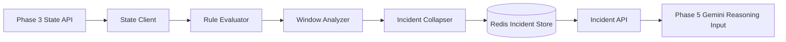

# Phase 4 -- Incident Engine

> **Objective:** Collapse noisy operational state into a small number of meaningful incidents.
> Phase 4 is deterministic: rules, thresholds, and simple statistical detection only. No AI.

---

## Scope

Phase 4 consumes Phase 3 state snapshots and detects sustained operational problems.

It should answer:

- "What incidents occurred during mission X?"
- "When did the incident begin and end?"
- "How severe was it?"
- "Which state signals contributed to it?"
- "Can Phase 5 analyze incidents instead of hundreds of state snapshots?"

Example:

```text
GPS weak + rising risk + unstable attitude across multiple states
    -> Navigation Instability Incident
```

Phase 4 must collapse repeated matching states into one incident rather than producing an incident for every state snapshot.

---

## Phase 3 Handoff

Phase 3 exposes state timelines:

```json
{
  "mission_id": "mission_20260608_120000",
  "states": [
    {
      "sequence": 42,
      "elapsed_ms": 42000,
      "phase": "cruise",
      "health": "degraded",
      "risk": 0.63,
      "signals": {
        "gps_quality": "weak",
        "battery_level": "normal",
        "altitude_stability": "normal",
        "attitude_stability": "weak"
      },
      "reasons": [
        "GPS satellites below nominal threshold"
      ]
    }
  ]
}
```

Phase 4 produces incidents:

```json
{
  "incident_id": "inc_01J...",
  "mission_id": "mission_20260608_120000",
  "incident_type": "navigation_instability",
  "severity": "high",
  "start_ms": 42000,
  "end_ms": 57000,
  "contributing_states": 16,
  "peak_risk": 0.78,
  "phases": ["cruise"],
  "evidence": [
    "GPS quality degraded during flight",
    "attitude unstable while cruising"
  ]
}
```

---

## Architecture



### Components

| Component | Responsibility |
|-----------|----------------|
| **State Client** | Fetch Phase 3 state timelines. |
| **Rule Evaluator** | Match individual states against deterministic conditions. |
| **Window Analyzer** | Detect trends and sustained degradation across recent states. |
| **Incident Collapser** | Merge consecutive matches into bounded incidents. |
| **Incident Store** | Store detected incidents and processing metadata in Redis. |
| **Incident API** | Trigger detection and query incidents. |

---

## Package Layout

```text
src/
+-- tars/
    +-- phase4/
        |-- __init__.py
        |-- api.py
        |-- config.py
        |-- detector.py
        |-- models.py
        |-- rules.py
        |-- service.py
        |-- state_client.py
        |-- statistics.py
        +-- store.py
```

Responsibilities:

- `models.py`: incident enums and API schemas.
- `rules.py`: single-state deterministic rules.
- `statistics.py`: rolling-window calculations and trend detection.
- `detector.py`: collapse rule matches into incidents.
- `state_client.py`: consume Phase 3 state timelines.
- `store.py`: Redis incident persistence.
- `service.py`: detection/query orchestration.
- `api.py`: FastAPI routes.

---

## Incident Model

### Incident Types

- `navigation_instability`
- `battery_degradation`
- `attitude_instability`
- `altitude_instability`
- `sensor_health_failure`
- `telemetry_degradation`
- `high_risk_state`

### Severity

- `low`
- `medium`
- `high`
- `critical`

### Incident Fields

| Field | Description |
|-------|-------------|
| `incident_id` | Stable unique identifier. |
| `mission_id` | Mission containing the incident. |
| `incident_type` | Classified deterministic incident type. |
| `severity` | Maximum severity reached during the incident. |
| `start_sequence` | First contributing state sequence. |
| `end_sequence` | Last contributing state sequence. |
| `start_ms` | Incident start elapsed time. |
| `end_ms` | Incident end elapsed time. |
| `contributing_states` | Number of collapsed states. |
| `peak_risk` | Highest Phase 3 risk score observed. |
| `phases` | Mission phases observed during the incident. |
| `evidence` | Explainable matched rules and state reasons. |

---

## Detection Rules

Initial thresholds should be conservative and easy to explain.

### Navigation Instability

Trigger when at least one condition persists for 3 states:

- GPS quality is `weak`, `unstable`, or `missing` during flight.
- GPS quality is degraded and state risk is at least `0.5`.
- GPS quality is degraded while attitude or altitude stability is degraded.

### Battery Degradation

Trigger when:

- Battery signal is `weak` for 3 states.
- Battery signal is `unstable` for 1 state.
- Battery percentage drops unusually fast across a rolling window.

### Attitude Instability

Trigger when:

- Attitude stability is `weak` or `unstable` during cruise for 3 states.
- Roll or pitch remains above the configured threshold across a window.

### Altitude Instability

Trigger when:

- Altitude stability is `unstable`.
- Altitude changes direction repeatedly within a short window.
- High vertical speed occurs near the ground.

### Sensor Health Failure

Trigger immediately when:

- Phase 3 health is `critical`.
- Evidence contains a failed sensor or position health check.

### Telemetry Degradation

Trigger when:

- Two or more state signals are `missing` for 2 states.
- Phase 3 health remains `unknown` during an active flight phase.

### High-Risk State

Trigger immediately when:

- Risk reaches `0.8`.
- Risk remains above `0.6` for 3 states.

---

## Incident Collapsing

The detector should not emit one incident per matching state.

Use these rules:

1. Open an incident when a rule meets its minimum persistence threshold.
2. Add later matching states to the open incident.
3. Close the incident after the rule no longer matches for a configured cooldown.
4. Merge matches of the same type when the gap is below `INCIDENT_MAX_GAP_MS`.
5. Preserve peak severity, peak risk, phases, and deduplicated evidence.

Recommended defaults:

```text
INCIDENT_MAX_GAP_MS=5000
INCIDENT_MIN_STATES=3
INCIDENT_HIGH_RISK=0.8
INCIDENT_ELEVATED_RISK=0.6
```

---

## Simple Statistical Detection

Phase 4 may use basic statistics, but no machine learning.

Useful calculations:

- Rolling mean.
- Rolling standard deviation.
- Rate of change.
- Consecutive threshold violations.
- Direction changes within a window.

Examples:

```text
battery_drop_rate > configured threshold
    -> battery_degradation

altitude direction changes >= 4 within 10 states
    -> altitude_instability

risk rolling mean >= 0.6 across 5 states
    -> high_risk_state
```

Keep every statistical rule configurable and explainable.

---

## Redis Key Design

PostgreSQL remains the durable mission record. Redis stores operational incidents for Phase 5 consumption.

### Incident Timeline

```text
tars:mission:{mission_id}:incidents:timeline
```

Type: sorted set

- score: incident `start_ms`
- member: serialized incident JSON

### Processing Metadata

```text
tars:mission:{mission_id}:incidents:meta
```

Type: hash

Fields:

- `status`
- `states_evaluated`
- `incidents_detected`
- `started_at`
- `completed_at`
- `error`

---

## API Contract

Phase 4 API default port:

```text
8003
```

### Health

```text
GET /health
```

Returns Redis and Phase 3 connectivity.

### Process Mission State

```text
POST /api/v1/incidents/process/{mission_id}
```

Request:

```json
{
  "from_ms": 0,
  "to_ms": null,
  "overwrite": true
}
```

Response:

```json
{
  "mission_id": "mission_20260608_120000",
  "states_evaluated": 342,
  "incidents_detected": 3,
  "status": "complete"
}
```

### List Incidents

```text
GET /api/v1/incidents/{mission_id}?from_ms=0&to_ms=60000
```

### Get Incident

```text
GET /api/v1/incidents/{mission_id}/{incident_id}
```

### Processing Status

```text
GET /api/v1/incidents/{mission_id}/status
```

---

## Implementation Steps

### Step 1: Verify Phase 3 Contract

Before implementing Phase 4:

- Confirm Phase 3 timelines are ordered.
- Ensure partial Phase 3 processing cannot replace full mission current state.
- Confirm Phase 3 returns reasons, signals, health, risk, metrics, and phases.

### Step 2: Add Configuration

Add `.env.example` values:

```text
PHASE3_API_URL=http://localhost:8002
INCIDENT_API_HOST=0.0.0.0
INCIDENT_API_PORT=8003
INCIDENT_MAX_GAP_MS=5000
INCIDENT_MIN_STATES=3
```

No new infrastructure dependency is required. Reuse Redis.

### Step 3: Implement Models and Rules

Implement incident enums, schemas, and pure state-rule evaluation.

Rules must:

- Be deterministic.
- Return matched incident type and evidence.
- Avoid Redis, HTTP, or database access.
- Be independently unit tested.

### Step 4: Implement Statistical Windows

Add reusable helpers for:

- Consecutive matches.
- Rolling averages.
- Rate of change.
- Oscillation/direction-change counts.

### Step 5: Implement Incident Collapser

Convert matched state sequences into bounded incidents.

Requirements:

- Stable incident IDs for repeated processing.
- Deterministic output ordering.
- Deduplicated evidence.
- Configurable persistence and gap thresholds.

### Step 6: Implement Redis Store

Functions:

- `replace_incidents(mission_id, incidents)`
- `get_incidents(mission_id, from_ms, to_ms)`
- `get_incident(mission_id, incident_id)`
- `set_status(mission_id, status, fields)`
- `get_status(mission_id)`
- `clear_incidents(mission_id)`

### Step 7: Implement State Client and Service

State client consumes:

```text
GET {PHASE3_API_URL}/api/v1/state/{mission_id}/timeline
```

Service flow:

1. Set status to `processing`.
2. Fetch Phase 3 state timeline.
3. Evaluate rules and windows.
4. Collapse matches into incidents.
5. Write incidents to Redis.
6. Set status to `complete`.
7. On failure, set status to `failed`.

### Step 8: Add API and Scripts

Add:

```text
scripts/start_incident_api.sh
scripts/process_mission_incidents.sh
```

### Step 9: Add Tests

Create:

```text
tests/phase4/test_rules.py
tests/phase4/test_statistics.py
tests/phase4/test_detector.py
tests/phase4/test_store.py
tests/phase4/test_service.py
tests/phase4/test_api.py
```

Minimum test scenarios:

- Nominal states produce no incidents.
- One transient weak GPS state produces no navigation incident.
- Sustained weak GPS collapses into one navigation incident.
- Critical health produces immediate sensor-health incident.
- Consecutive high-risk states collapse into one high-risk incident.
- Incident severity reflects peak state risk.
- Detection is deterministic across repeated runs.
- Redis tests use a separate test database and never flush development DB 0.

---

## Definition of Done

Phase 4 is complete when:

1. Phase 4 consumes Phase 3 state timelines through the Phase 3 API.
2. Deterministic rules detect supported incident types.
3. Repeated noisy state matches collapse into single incidents.
4. Incident evidence explains why each incident was created.
5. Incidents are stored and queryable through Redis.
6. Incident API runs independently on port `8003`.
7. Nominal missions produce no incidents.
8. Known fault scenarios produce expected incidents.
9. Tests cover rules, collapsing, persistence, and API behavior.
10. Phase 5 can consume incidents without reading raw telemetry or state timelines.

---

## Explicit Non-Goals

Do not build these in Phase 4:

- Gemini or another LLM.
- Root-cause reasoning.
- Recommendations or autonomous mitigation.
- Phoenix tracing.
- Neo4j operational memory.
- Kafka.
- Machine-learning anomaly models.
- Dashboard.

Phase 4 only turns noisy operational state into deterministic, explainable incidents.
