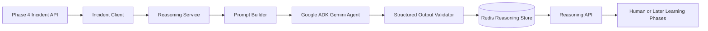

# Phase 5 -- Gemini Reasoning Layer

> **Objective:** Analyze bounded Phase 4 incidents and produce structured,
> advisory root-cause assessments and recommendations.
>
> Phase 5 is an analysis layer only. It must never issue flight commands,
> modify mission state, or participate in the flight-critical control path.

---

## Scope

Phase 5 consumes individual incidents produced by the Phase 4 Incident Engine.
It uses Gemini to reason over the incident's deterministic evidence and returns
a validated, explainable analysis.

It should answer:

- "What is the most likely root cause of this incident?"
- "How confident is the reasoning?"
- "Which incident evidence supports the conclusion?"
- "What operational action should be considered?"
- "What information is missing or uncertain?"

Example input:

```json
{
  "incident_id": "inc_01J...",
  "mission_id": "mission_20260608_120000",
  "incident_type": "navigation_instability",
  "severity": "high",
  "start_ms": 42000,
  "end_ms": 57000,
  "contributing_states": 16,
  "peak_risk": 0.78,
  "phases": ["cruise"],
  "evidence": [
    "GPS quality degraded during flight",
    "attitude unstable while cruising"
  ]
}
```

Example output:

```json
{
  "root_cause": "gps_interference",
  "confidence": 0.91,
  "recommendation": "consider switching to visual navigation",
  "rationale": "Sustained GPS degradation preceded attitude instability.",
  "contributing_factors": [
    "weak GPS quality during cruise",
    "elevated mission risk"
  ],
  "uncertainties": [
    "No environmental interference measurement is available"
  ]
}
```

---

## Non-Goals

Phase 5 must not:

- Consume raw telemetry directly.
- Reimplement Phase 3 state classification or Phase 4 incident detection.
- Send commands to PX4, MAVSDK, or any flight-control component.
- Automatically execute recommendations.
- Add Phoenix/OpenInference tracing; that belongs to Phase 6.
- Add Neo4j operational memory; that belongs to Phase 7.
- Train or fine-tune a model.
- Treat Gemini output as confirmed fact.

---

## Phase 4 Handoff

Phase 4 remains the source of truth for incident facts. Phase 5 should retrieve
an incident through:

```text
GET /api/v1/incidents/{mission_id}/{incident_id}
```

Only the bounded incident contract should be sent to Gemini:

- Incident type and severity.
- Start and end times.
- Number of contributing states.
- Peak risk.
- Mission phases.
- Deduplicated evidence.

This keeps prompts small, explainable, and independent of mission length.

---

## Architecture



### Components

| Component | Responsibility |
|-----------|----------------|
| **Incident Client** | Fetch and validate one bounded Phase 4 incident. |
| **Prompt Builder** | Build a versioned, incident-only reasoning prompt. |
| **Gemini Agent** | Produce root-cause analysis through Google ADK and Gemini. |
| **Output Validator** | Reject malformed or unsafe model responses. |
| **Reasoning Store** | Persist the latest structured analysis per incident in Redis. |
| **Reasoning Service** | Orchestrate retrieval, reasoning, validation, and persistence. |
| **Reasoning API** | Trigger analysis and query persisted results. |

---

## Package Layout

```text
src/
+-- tars/
    +-- phase5/
        |-- __init__.py
        |-- api.py
        |-- config.py
        |-- incident_client.py
        |-- models.py
        |-- prompts.py
        |-- agent.py
        |-- provider.py
        |-- store.py
        +-- service.py
```

Responsibilities:

- `models.py`: reasoning schemas, enums, and API contracts.
- `prompts.py`: versioned system instruction and incident prompt.
- `agent.py`: Google ADK agent configuration.
- `provider.py`: provider-neutral interface around Gemini execution.
- `incident_client.py`: consume the Phase 4 Incident API.
- `store.py`: Redis reasoning-result persistence.
- `service.py`: reasoning orchestration and overwrite behavior.
- `api.py`: FastAPI routes.

The provider interface must be injectable so tests never require live Gemini
credentials or network calls.

---

## Reasoning Model

### Required Fields

| Field | Description |
|-------|-------------|
| `reasoning_id` | Unique identifier for this analysis execution. |
| `mission_id` | Mission containing the analyzed incident. |
| `incident_id` | Phase 4 incident being analyzed. |
| `incident_type` | Incident type copied from Phase 4. |
| `root_cause` | Most likely concise cause classification. |
| `confidence` | Model confidence from `0.0` to `1.0`. |
| `recommendation` | Advisory operational recommendation. |
| `rationale` | Short explanation grounded in incident evidence. |
| `contributing_factors` | Evidence-backed supporting factors. |
| `uncertainties` | Missing information or plausible alternatives. |
| `model` | Gemini model identifier used. |
| `prompt_version` | Version of the reasoning prompt. |
| `created_at` | UTC analysis timestamp. |
| `advisory_only` | Always `true`. |

### Validation Rules

- Confidence must be between `0.0` and `1.0`.
- Root cause, recommendation, and rationale must be non-empty.
- Recommendations must remain advisory and must not be control commands.
- Contributing factors must be traceable to supplied incident evidence.
- Unknown or ambiguous evidence must reduce confidence.
- Invalid structured output must fail the request and must not be persisted.

---

## Google ADK and Gemini Integration

Use Google ADK to define a single-purpose incident-analysis agent backed by
Gemini. Keep the agent deliberately narrow:

- One incident per invocation.
- No tools that can control the drone or mutate upstream data.
- Structured response schema enforced at the provider boundary.
- Low temperature for stable operational reasoning.
- Versioned system instruction.
- Explicit instruction to avoid inventing telemetry.

The Gemini model name must be configurable through `GEMINI_MODEL`. Credentials
must come from `GEMINI_API_KEY`; no credentials may be committed.

### Provider Boundary

Define an async provider contract similar to:

```python
class ReasoningProvider(Protocol):
    @property
    def model_name(self) -> str: ...

    def is_configured(self) -> bool: ...

    async def analyze(self, incident: Incident) -> ReasoningAnalysis: ...
```

Production uses the ADK Gemini provider. Tests use a deterministic fake
provider.

---

## Prompt Design

The system instruction should establish:

1. The model is an advisory incident analyst.
2. Phase 4 incident data is the complete evidence available.
3. Conclusions must be grounded in supplied evidence.
4. Ambiguity must be represented through confidence and uncertainties.
5. Recommendations must not claim execution or issue actuator commands.
6. Output must conform to the structured response schema.

Prompt content should include:

- Prompt version.
- Incident JSON.
- Required reasoning task.
- Required output schema.

Do not include the entire mission timeline or unrelated incidents in Phase 5.

---

## Persistence

Use Redis, consistent with Phases 3 and 4.

Recommended key:

```text
tars:mission:{mission_id}:reasoning:analyses
```

Store analyses in a hash:

```text
field = incident_id
value = ReasoningResult JSON
```

Initial behavior:

- One current analysis per incident.
- `overwrite=true` invokes Gemini and replaces the current analysis.
- `overwrite=false` returns an existing analysis without invoking Gemini.
- Failed or invalid analyses are never persisted.

Historical reasoning executions and long-term memory are deferred to later
phases.

---

## API Design

Run the Phase 5 API on port `8004`.

### Analyze Incident

```text
POST /api/v1/reasoning/analyze/{mission_id}/{incident_id}
```

Request:

```json
{
  "overwrite": true
}
```

Behavior:

1. Fetch the incident from Phase 4.
2. Invoke the Gemini reasoning provider.
3. Validate the structured response.
4. Persist and return the result.

### Get Incident Analysis

```text
GET /api/v1/reasoning/{mission_id}/{incident_id}
```

Returns the current persisted analysis for the incident.

### List Mission Analyses

```text
GET /api/v1/reasoning/{mission_id}
```

Returns all persisted incident analyses for the mission.

### Health

```text
GET /health
```

Report:

- API status.
- Redis connectivity.
- Phase 4 API reachability.
- Gemini provider configuration status.

A missing Gemini key should report `unconfigured`, not crash API startup.

---

## Configuration

Add these environment variables:

```text
PHASE4_API_URL=http://localhost:8003
REASONING_API_HOST=0.0.0.0
REASONING_API_PORT=8004
INCIDENT_CLIENT_TIMEOUT=30.0
GEMINI_API_KEY=
GEMINI_MODEL=<supported-gemini-model>
GEMINI_TEMPERATURE=0.1
```

Add the required Google ADK and Gemini SDK dependencies to
`requirements.txt`, pinning compatible major versions after validating the
current official SDK guidance.

---

## Failure Handling

| Failure | Expected Behavior |
|---------|-------------------|
| Phase 4 incident not found | Return `404`; do not invoke Gemini. |
| Phase 4 unavailable | Return `502`; do not invoke Gemini. |
| Gemini key missing | Return a clear provider-configuration error. |
| Gemini timeout or quota error | Return `502`; do not persist a result. |
| Malformed model output | Reject validation; do not persist a result. |
| Redis unavailable | Return service error; do not claim persistence. |
| Identifier mismatch | Reject the Phase 4 response. |

Errors must not expose API keys, full provider payloads, or sensitive headers.

---

## Testing Strategy

### Pure Unit Tests

- Prompt includes only the supplied incident.
- Prompt contains advisory and evidence-grounding constraints.
- Structured reasoning model validates confidence bounds.
- Invalid or empty model fields are rejected.
- Provider output is validated before persistence.

### Service Tests

- Analyze and persist a new incident.
- Return existing analysis when `overwrite=false`.
- Reinvoke provider and replace when `overwrite=true`.
- Do not persist when provider reasoning fails.
- Reject mismatched mission or incident identifiers.
- Preserve model and prompt-version metadata.

### Client Tests

- Fetch and validate a Phase 4 incident.
- Raise on Phase 4 `404` and `5xx` responses.
- Report Phase 4 health correctly.

### Store Tests

- Save, retrieve, list, replace, and clear analyses.
- Isolate analyses by mission.
- Skip Redis integration tests when Redis is unavailable.

### API Tests

- Analyze, get, list, and health endpoints.
- Correct `404` and `502` mappings.
- Test with fake incident client, fake provider, and test Redis DB.
- No live Gemini calls in the automated test suite.

---

## Implementation Sequence

### Step 1 -- Contracts and Configuration

- Create the Phase 5 package.
- Add Pydantic input, output, and API models.
- Add Phase 5 environment settings.
- Define the provider-neutral reasoning interface.

### Step 2 -- Phase 4 Integration

- Implement the async Incident Client.
- Validate returned incidents against the Phase 4 model.
- Add client and identifier-mismatch tests.

### Step 3 -- Prompt and Gemini Agent

- Create the versioned incident-only prompt.
- Configure the Google ADK Gemini agent.
- Enforce structured output.
- Add a deterministic fake provider for tests.

### Step 4 -- Persistence and Service

- Implement the Redis Reasoning Store.
- Implement analyze, overwrite, get, and list orchestration.
- Guarantee that failed analyses are never stored.

### Step 5 -- API and Scripts

- Add the FastAPI application on port `8004`.
- Add `scripts/start_reasoning_api.sh`.
- Add `scripts/analyze_incident.sh`.
- Add health and error mapping.

### Step 6 -- Verification and Documentation

- Add Phase 5 tests.
- Run Phase 5 and full regression suites.
- Update `.env.example`, `requirements.txt`, and `README.md`.
- Verify no endpoint or provider can issue flight-control commands.

---

## Acceptance Criteria

Phase 5 is complete when:

- A Phase 4 incident can be analyzed through the Phase 5 API.
- Gemini receives only the bounded incident, not raw telemetry.
- The result conforms to the strict structured reasoning schema.
- Every recommendation is marked advisory-only.
- Existing analyses can be reused without invoking Gemini.
- Invalid or failed provider output is never persisted.
- Tests run without live Gemini credentials.
- Phase 4 behavior and tests remain unchanged.
- No Phoenix tracing or Neo4j memory is introduced.

---

## Deliverables

- `src/tars/phase5/` reasoning package.
- Phase 5 FastAPI service on port `8004`.
- Google ADK Gemini provider with structured output.
- Redis reasoning-result store.
- Start and analysis scripts.
- Phase 5 unit, service, store, client, and API tests.
- Updated dependency, environment, and README documentation.
