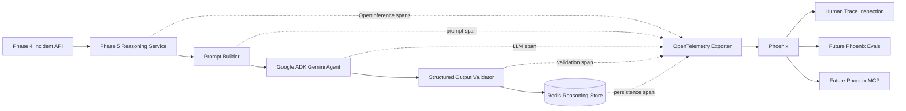

# Phase 6 -- Phoenix Integration

> **Objective:** Observe cognition, not just missions.
>
> Capture every Phase 5 reasoning decision as an OpenInference trace that can
> be inspected in Phoenix, without placing Phoenix or tracing on the
> flight-critical control path.

---

## Product Context

Existing drone platforms monitor missions. TARS is designed to learn from
missions.

Every failure, mitigation, outcome, agent decision, and future evaluation
should become operational knowledge that improves later recommendations.
Phase 6 creates the observability foundation for that learning loop by making
the Phase 5 agent's reasoning behavior traceable.

Phases 1 through 4 explain what happened operationally:

- Phase 1 captures telemetry.
- Phase 2 makes missions replayable.
- Phase 3 transforms telemetry into operational state.
- Phase 4 collapses noisy state into deterministic incidents.

Phase 5 explains what the incident may mean. Phase 6 explains how that
reasoning decision was produced.

---

## Scope

Phase 6 instruments the Phase 5 Gemini Reasoning Layer with OpenInference
tracing and exports traces to Phoenix.

It should answer:

- "Which incident caused this reasoning execution?"
- "Which prompt and prompt version were used?"
- "Which model produced the response?"
- "What structured response did the model return?"
- "How long did incident retrieval, model inference, validation, and
  persistence take?"
- "Did the request return a cached analysis or invoke Gemini?"
- "Where did a failed reasoning request fail?"
- "Can a human inspect the complete decision path?"

Phase 6 captures:

- Bounded Phase 4 incident input.
- Versioned Phase 5 prompt.
- Gemini model invocation and response.
- Structured reasoning result.
- Future agent tool calls, when tools are introduced.
- Latency for each reasoning stage.
- Exceptions and failure status.
- Correlation identifiers for mission, incident, and reasoning execution.

Phoenix is an analysis-path dependency only. A Phoenix outage must never
affect PX4, mission execution, state processing, incident detection, or the
ability of Phase 5 to produce reasoning results.

---

## Success Statement

Phase 6 succeeds when every Phase 5 reasoning decision can be opened in
Phoenix and understood from incident input through final persisted result.

```text
Mission incident
    -> reasoning request
    -> bounded prompt
    -> Gemini invocation
    -> structured response
    -> validation
    -> persisted recommendation
```

The trace should make both successful and failed reasoning executions
inspectable.

---

## Non-Goals

Phase 6 must not:

- Trace raw Phase 1 telemetry.
- Add tracing to PX4, MAVSDK, or the flight-critical control path.
- Change Phase 3 state classification or Phase 4 incident detection.
- Change the reasoning or recommendation produced by Phase 5.
- Block or fail reasoning because Phoenix is unavailable.
- Add Phoenix evaluations; those belong to Phase 9.
- Add Phoenix MCP self-introspection; that belongs to Phase 8.
- Add Neo4j operational memory; that belongs to Phase 7.
- Build the learning engine or adaptive recommendation engine.
- Automatically execute recommendations or mitigations.
- Introduce Kafka, Kubernetes, or distributed tracing across every service.
- Store secrets, API keys, authorization headers, or unbounded payloads in
  traces.

Phase 6 observes reasoning behavior. It does not evaluate, learn from, or act
on that behavior yet.

---

## Architecture



### Runtime Boundary

```text
Flight-critical path:
PX4 -> telemetry -> state -> deterministic incident detection

Analysis path:
incident -> Gemini reasoning -> OpenInference trace -> Phoenix
```

Phoenix and Gemini remain outside the flight-critical path. Tracing must be
best-effort and fail open.

### Components

| Component | Responsibility |
|-----------|----------------|
| **Tracing Configuration** | Load Phoenix endpoint, project, content, and exporter settings. |
| **Tracing Bootstrap** | Configure OpenTelemetry, OpenInference, exporter, and shutdown flushing. |
| **Reasoning Instrumentation** | Create the parent trace for one reasoning decision. |
| **Gemini Instrumentation** | Capture the model invocation using OpenInference semantics. |
| **Phoenix** | Receive, store, and visualize traces. |
| **In-Memory Exporter** | Capture spans deterministically in automated tests. |

---

## Package Layout

Create a small Phase 6 package that owns observability concerns while Phase 5
keeps ownership of reasoning behavior.

```text
src/
+-- tars/
    +-- phase6/
        |-- __init__.py
        |-- config.py
        |-- attributes.py
        +-- tracing.py
```

Responsibilities:

- `config.py`: Phoenix and tracing environment settings.
- `attributes.py`: stable TARS/OpenInference attribute names and helpers.
- `tracing.py`: tracer-provider setup, exporter setup, no-op behavior, and
  shutdown flushing.

Phase 5 modules should depend only on the small tracing API exposed by Phase
6. They must not configure exporters directly.

Tests:

```text
tests/
+-- phase6/
    |-- __init__.py
    |-- test_config.py
    |-- test_tracing.py
    +-- test_reasoning_traces.py
```

---

## Trace Model

One call to analyze an incident produces one root trace.

Recommended span hierarchy:

```text
reasoning.analyze
|-- reasoning.cache_lookup
|-- phase4.get_incident
|-- reasoning.build_prompt
|-- gemini.generate
|-- reasoning.validate
+-- reasoning.persist
```

### Root Span

Span name:

```text
reasoning.analyze
```

The root span represents one complete reasoning decision, including cached
responses.

Required attributes:

| Attribute | Description |
|-----------|-------------|
| `tars.mission.id` | Mission correlation identifier. |
| `tars.incident.id` | Phase 4 incident identifier. |
| `tars.incident.type` | Deterministic Phase 4 incident type. |
| `tars.incident.severity` | Incident severity. |
| `tars.reasoning.id` | Phase 5 reasoning execution identifier, when created. |
| `tars.reasoning.cached` | Whether an existing analysis was returned. |
| `tars.reasoning.overwrite` | Requested overwrite behavior. |
| `tars.reasoning.prompt_version` | Version of the reasoning prompt. |
| `tars.reasoning.root_cause` | Structured root-cause classification. |
| `tars.reasoning.confidence` | Structured model confidence. |
| `tars.reasoning.advisory_only` | Must always be `true`. |
| `tars.reasoning.outcome` | `success`, `cached`, or `failed`. |

### Gemini Span

Span name:

```text
gemini.generate
```

Use OpenInference LLM semantic conventions wherever supported.

Capture:

- Model name.
- Provider name.
- Prompt version.
- Bounded input prompt.
- Structured output.
- Invocation duration.
- Token usage when provided by the SDK.
- Provider error type and message.

The Gemini span must be a child of the reasoning trace so Phoenix shows the
model call in its decision context.

### Future Tool Spans

The current Phase 5 agent intentionally has no tools that can control the
drone or mutate upstream data. If later analysis-only tools are introduced,
their calls should appear as child spans using OpenInference tool semantics.

Tool tracing in Phase 6 means instrumentation support, not adding new tools.

---

## Trace Content Policy

Phase 6 needs enough content to inspect cognition while keeping traces bounded
and safe.

### Allowed Content

- The bounded Phase 4 incident contract.
- The versioned Phase 5 system instruction.
- The incident-only prompt.
- The structured Gemini response.
- The validated Phase 5 reasoning result.
- Model, prompt, timing, and correlation metadata.

### Prohibited Content

- Raw mission telemetry timelines.
- Unbounded Phase 3 state timelines.
- API keys or credentials.
- Authorization headers.
- Redis connection credentials.
- Full HTTP request or response headers.
- Internal exception data containing secrets.
- Unrelated incidents or mission history.

### Content Capture Modes

Support a configurable content-capture policy:

| Mode | Behavior |
|------|----------|
| `full` | Capture bounded prompt and structured response. Recommended for local development and demonstrations. |
| `metadata` | Capture identifiers, model, timing, outcome, and classifications without prompt/response bodies. |
| `disabled` | Do not initialize tracing or export spans. |

Content mode should be explicit. Production-like environments should be able
to use metadata-only traces without code changes.

---

## OpenInference and Phoenix Integration

Use OpenInference semantic conventions for generative-AI spans and
OpenTelemetry for trace creation and export.

The integration should:

1. Configure one tracer provider for the Phase 5 process.
2. Set the Phoenix project name through resource or exporter attributes.
3. Export spans through OTLP to Phoenix.
4. Use OpenInference attributes for LLM input, output, model, and token usage.
5. Add TARS-specific correlation attributes for missions and incidents.
6. Flush pending spans during API shutdown.
7. Return a no-op tracer when tracing is disabled.
8. Log exporter problems without failing reasoning requests.

Prefer supported Google ADK/OpenInference instrumentation when it produces the
required model spans. Add manual spans only where automatic instrumentation
does not expose the required TARS context or stage boundaries.

Dependency versions must be validated together before pinning because Google
ADK, OpenTelemetry, OpenInference, and Phoenix share observability
dependencies.

---

## Configuration

Add Phase 6 environment settings:

```text
PHOENIX_ENABLED=false
PHOENIX_ENDPOINT=http://localhost:6006
PHOENIX_PROJECT_NAME=tars-phase5-reasoning
PHOENIX_CONTENT_MODE=full
PHOENIX_EXPORT_TIMEOUT_SECONDS=5.0
PHOENIX_BATCH_EXPORT=true
```

Recommended behavior:

- `PHOENIX_ENABLED=false` keeps existing Phase 5 behavior unchanged.
- Phoenix being enabled but unreachable logs a warning and does not block
  analysis.
- Local demonstration environments use `full` content mode.
- Metadata-only mode remains available for more restrictive environments.
- Invalid configuration fails tracing setup clearly but does not prevent API
  startup.

No Phoenix credentials may be committed. If a hosted Phoenix deployment is
used later, authentication must come from environment variables.

---

## Phase 5 Integration Points

### Reasoning Service

Instrument `ReasoningService.analyze_incident()` as the root decision span.

The service instrumentation should:

1. Attach mission and incident identifiers immediately.
2. Record whether overwrite was requested.
3. Record cache hit or miss.
4. Add incident type and severity after Phase 4 retrieval.
5. Keep the provider invocation under the same trace context.
6. Add reasoning ID, root cause, confidence, and advisory status after
   validation.
7. Mark failures and record exceptions.
8. Never change service return values or exception behavior.

### Gemini Provider

Instrument `GeminiReasoningProvider.analyze()` as the LLM span.

The provider instrumentation should:

1. Attach model and prompt-version metadata.
2. Capture the bounded prompt according to content mode.
3. Capture the model response according to content mode.
4. Record provider latency and token usage when available.
5. Mark empty, malformed, or invalid output as an error.
6. Preserve existing session cleanup behavior.

### FastAPI Lifecycle

The Phase 5 API lifespan should:

1. Initialize tracing before the Reasoning Service begins handling requests.
2. Log whether tracing is enabled, disabled, or unavailable.
3. Flush and shut down tracing after pending requests complete.

Phase 5 must remain independently runnable when Phase 6 dependencies or
Phoenix infrastructure are unavailable.

### Health Reporting

Extend the Phase 5 health response with tracing status:

```json
{
  "status": "ok",
  "redis": "ok",
  "phase4": "ok",
  "gemini": "ok",
  "phoenix": "ok"
}
```

Allowed Phoenix values:

- `ok`
- `disabled`
- `unavailable`

Phoenix status must not change the overall API status to unhealthy because
tracing is non-critical.

---

## Failure Handling

| Failure | Expected Behavior |
|---------|-------------------|
| Phoenix disabled | Use no-op tracing; Phase 5 behavior is unchanged. |
| Phoenix unavailable at startup | Log warning; start Phase 5 normally. |
| Phoenix becomes unavailable | Drop or retry spans within exporter limits; do not fail reasoning. |
| Export queue is full | Drop spans with a warning; do not block requests. |
| Trace serialization fails | Record/log the tracing error; continue reasoning. |
| Gemini invocation fails | Mark the Gemini and root spans as errors; preserve existing API error behavior. |
| Phase 4 retrieval fails | Mark the root and retrieval spans as errors; do not create a Gemini span. |
| Validation fails | Mark validation and root spans as errors; do not persist reasoning. |
| Redis persistence fails | Mark persistence and root spans as errors; preserve existing API behavior. |
| Shutdown flush times out | Log warning and complete process shutdown. |

Tracing code must never hide or replace the original application exception.

---

## Phoenix Inspection Workflow

For a successful decision, an operator should be able to:

1. Search Phoenix by mission ID or incident ID.
2. Open the `reasoning.analyze` trace.
3. Inspect the bounded incident and prompt.
4. Inspect the Gemini model response.
5. Confirm validation and persistence completed.
6. Compare total latency with Gemini invocation latency.
7. Identify the final root cause, confidence, and recommendation.

For a failed decision, an operator should be able to:

1. Find the failed trace by mission or incident ID.
2. Identify the stage that failed.
3. Inspect the safe error message and span status.
4. Confirm that no invalid reasoning result was persisted.

This workflow is the demonstrable Phase 6 capability.

---

## Testing Strategy

Automated tests must use an in-memory span exporter. They must not require a
running Phoenix instance or live Gemini credentials.

### Configuration Tests

- Tracing is disabled by default.
- Content mode accepts supported values.
- Invalid content mode is rejected or safely falls back.
- Endpoint, project name, timeout, and batching settings load correctly.

### Tracing Bootstrap Tests

- Disabled tracing returns no-op behavior.
- Enabled tracing configures one tracer provider.
- Repeated initialization is safe.
- Exporter initialization failure does not crash Phase 5.
- Shutdown flushes the configured provider.

### Reasoning Trace Tests

- Successful analysis emits one root reasoning span.
- Mission and incident IDs are attached.
- Incident type and severity are attached after retrieval.
- Model, prompt version, root cause, and confidence are attached.
- Cached analysis records `tars.reasoning.cached=true`.
- Overwrite analysis records `tars.reasoning.overwrite=true`.
- Parent-child span relationships are correct.

### Content Policy Tests

- Full mode captures the bounded prompt and structured response.
- Metadata mode excludes prompt and response content.
- Raw telemetry fields are never included.
- Credentials and HTTP authorization headers are never included.
- Trace payload size remains bounded by the incident-only contract.

### Failure Trace Tests

- Phase 4 `404` and connection failures produce error spans.
- Gemini provider failure produces an error LLM span.
- Malformed model output produces a validation error span.
- Persistence failure produces a persistence error span.
- Tracing/export failure does not change the reasoning result or API error.

### Regression Tests

- Existing Phase 5 tests pass with tracing disabled.
- Existing Phase 5 tests pass with an in-memory exporter enabled.
- Earlier phase behavior remains unchanged.
- No automated test sends spans to an external Phoenix instance.

---

## Implementation Sequence

### Step 1 -- Trace Contract and Configuration

- Create the Phase 6 package.
- Define stable TARS trace attribute names.
- Add Phoenix and content-mode environment settings.
- Document the parent-child span hierarchy.
- Validate dependency compatibility before pinning versions.

### Step 2 -- Tracing Bootstrap

- Configure OpenTelemetry and the OTLP exporter.
- Apply OpenInference semantic conventions.
- Implement disabled/no-op behavior.
- Implement safe initialization and shutdown flushing.
- Add bootstrap and configuration tests.

### Step 3 -- Reasoning Service Instrumentation

- Add the root reasoning span.
- Instrument cache lookup, Phase 4 retrieval, validation, and persistence.
- Attach mission, incident, reasoning, and outcome metadata.
- Record failures without changing existing exception behavior.
- Add service-level trace tests.

### Step 4 -- Gemini Instrumentation

- Add or configure the OpenInference LLM span.
- Capture bounded prompt and response according to content mode.
- Capture model, prompt version, latency, and token usage when available.
- Record Gemini and structured-output failures.
- Add provider trace and privacy tests.

### Step 5 -- API Lifecycle and Health

- Initialize tracing during Phase 5 API startup.
- Flush tracing during shutdown.
- Add Phoenix status to the health endpoint.
- Confirm unavailable Phoenix does not make Phase 5 unhealthy.
- Add API lifecycle and health tests.

### Step 6 -- Local Demonstration and Documentation

- Add Phase 6 settings to `.env.example`.
- Add required dependencies to `requirements.txt`.
- Document how to run or connect to Phoenix locally.
- Document how to inspect a successful and failed reasoning trace.
- Update the README architecture and roadmap.

### Step 7 -- Verification

- Run Phase 5 and Phase 6 test suites.
- Run the full regression suite.
- Generate one successful reasoning trace.
- Generate one failed reasoning trace.
- Confirm both are inspectable in Phoenix.
- Confirm Phase 5 continues working with Phoenix stopped.
- Confirm no raw telemetry or credentials appear in traces.

---

## Acceptance Criteria

Phase 6 is complete when:

1. Every Phase 5 reasoning execution creates one correlated root trace when
   tracing is enabled.
2. Each trace identifies its mission and incident.
3. Successful traces show incident retrieval, prompt construction, Gemini
   invocation, validation, and persistence.
4. Failed traces identify the failed reasoning stage and preserve the original
   application error behavior.
5. Phoenix can display the bounded prompt, response, model, reasoning result,
   and latency in full-content mode.
6. Metadata-only mode excludes prompt and response bodies.
7. Cached reasoning responses are distinguishable from new Gemini
   invocations.
8. Phoenix being disabled or unavailable never prevents Phase 5 reasoning.
9. No raw telemetry, credentials, or flight-control data are exported.
10. Automated tests run without Phoenix infrastructure or live Gemini calls.
11. Existing Phase 5 and earlier-phase behavior remains unchanged.
12. A human can inspect every reasoning decision end to end in Phoenix.

---

## Deliverables

- `src/tars/phase6/` tracing package.
- OpenInference instrumentation for the Phase 5 reasoning path.
- Phoenix OTLP exporter configuration.
- Correlated reasoning, Gemini, validation, and persistence spans.
- Configurable full, metadata-only, and disabled content modes.
- Phoenix status in the Phase 5 health endpoint.
- In-memory tracing tests with no external infrastructure dependency.
- Updated dependency, environment, README, and local-operation
  documentation.

---

## Later Phase Handoffs

Phase 6 produces inspectable traces. Later phases consume their meaning.

### Phase 8 -- Phoenix MCP

Phoenix MCP will allow the agent to query relevant traces and introspect its
own repeated behavior. Phase 6 must therefore preserve stable mission,
incident, model, prompt-version, and outcome attributes.

### Phase 9 -- Evaluation Layer

Phoenix evaluations will measure root-cause accuracy, recommendation quality,
response consistency, false positives, and false negatives. Phase 6 does not
calculate these scores, but its trace contract must make the required inputs
available.

### Phase 10 -- Learning Engine

The Learning Engine will combine traces, evaluations, mission outcomes, and
operational memory to propose candidate knowledge. Phase 6 provides the
decision history, not the learning logic.

The boundary is deliberate:

```text
Phase 6: What did the agent do, and how?
Phase 8: What can the agent discover about its own behavior?
Phase 9: How good was the decision?
Phase 10: What should the platform learn from repeated outcomes?
```

---

## Implementation Notes

### Completed: 2026-06-14

Phase 6 has been implemented following the plan above. Key implementation
details:

#### Package Structure

```text
src/tars/phase6/
├── __init__.py      # Package docstring
├── config.py        # PhoenixSettings with ContentMode enum
├── attributes.py    # Stable TARS + OpenInference attribute constants
└── tracing.py       # TracerProvider setup, OTLP exporter, no-op, shutdown
```

#### Phase 5 Instrumentation

The following Phase 5 modules were modified to add tracing:

- `service.py` — Root `reasoning.analyze` span with child spans for
  cache lookup, Phase 4 retrieval, validation, and persistence.
- `provider.py` — `gemini.generate` span with OpenInference LLM
  attributes in both `GeminiReasoningProvider` and `FakeReasoningProvider`.
- `api.py` — Tracing initialization in lifespan, Phoenix status in
  health endpoint.
- `models.py` — Added `phoenix` field to `HealthResponse`.

Phase 5 remains independently runnable when Phase 6 dependencies are
unavailable. All Phase 6 imports use try/except with graceful fallback.

#### Dependencies Added

```text
opentelemetry-api>=1.20.0
opentelemetry-sdk>=1.20.0
opentelemetry-exporter-otlp-proto-http>=1.20.0
```

Phoenix itself (`arize-phoenix`) is optional and only needed when
running a local Phoenix server.

#### Test Results

- **89 Phase 6 tests** — all passing
- **120 Phase 5 tests** — all passing (zero regressions)
- **419 total tests** across Phases 3–6 — all passing

Test categories implemented:
- Configuration (31 tests)
- Tracing bootstrap (14 tests)
- Reasoning traces (44 tests including hierarchy, attributes, cache,
  content policy, safety, failures, overwrite, and isolation)

All tests use an in-memory span exporter. No running Phoenix instance
or live Gemini credentials are required.

#### Span Hierarchy Verified

```text
reasoning.analyze
├── reasoning.cache_lookup    (when overwrite=false)
├── phase4.get_incident
├── gemini.generate
├── reasoning.validate
└── reasoning.persist
```

#### Content Modes Verified

- `full` — captures bounded prompt and structured response
- `metadata` — captures identifiers, model, timing, outcome only
- `disabled` — no tracing initialization
