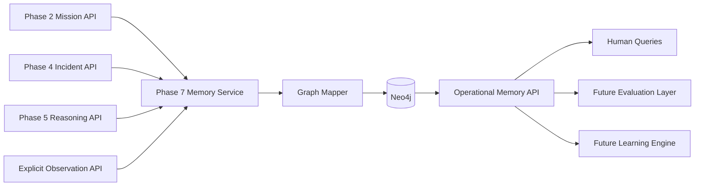

# Phase 7 -- Neo4j Operational Memory

> **Objective:** Turn completed mission facts, incidents, reasoning results,
> mitigations, and outcomes into queryable operational memory.
>
> Phase 7 answers "Have we seen this before?" It does not yet decide what was
> correct, learn a new rule, or adapt a recommendation.

---

## Product Context

Existing drone platforms monitor missions. TARS is designed to learn from
missions.

Phases 1 through 6 produce replayable mission facts, deterministic incidents,
advisory reasoning, and inspectable cognition. Those facts currently remain
split across PostgreSQL, Redis, and Phoenix. Phase 7 creates a durable graph
projection that connects them without replacing their source systems.

The graph should make operational history traversable:

```text
Mission
    -> experienced Incident
    -> analyzed as RootCause
    -> recommended or applied Mitigation
    -> resulted in Outcome
```

This is the first phase that can answer:

- "Have we seen this incident type before?"
- "Which missions had similar incidents?"
- "Which root causes were proposed for navigation instability?"
- "What mitigations were recommended or actually applied?"
- "What outcomes followed?"
- "Which reasoning execution and prompt version produced this conclusion?"

---

## Scope

Phase 7 introduces a standalone Operational Memory service backed by Neo4j.
It imports bounded facts from existing phase APIs and exposes graph-backed
history queries.

Phase 7 owns:

- Neo4j connection and schema initialization.
- Idempotent projection of missions, incidents, and current reasoning results.
- Explicit recording of applied mitigations and observed outcomes.
- Provenance for every graph fact.
- Similar-history and graph-neighborhood queries.
- Sync status, retry behavior, and reconciliation.

Phase 7 must preserve the distinction between:

- A Phase 5 recommendation and a mitigation that was actually applied.
- A model-proposed root cause and a validated root cause.
- A mission result and an incident-specific outcome.
- A current Redis analysis and its historical reasoning execution.

---

## Success Statement

Phase 7 succeeds when an operator can sync a completed mission and query:

```text
Have we seen navigation_instability before?
```

The response must return prior incidents with their missions, proposed root
causes, recommendations, any explicitly observed mitigations, and outcomes,
with enough provenance to trace each fact back to its source phase.

---

## Non-Goals

Phase 7 must not:

- Replace PostgreSQL as the mission replay source of truth.
- Replace Redis as the live operational state, incident, or reasoning store.
- Replace Phoenix as the reasoning-trace store.
- Read raw telemetry or Phase 3 state timelines into Neo4j.
- Infer that a recommendation was applied.
- Infer that a mitigation caused an outcome.
- Treat Gemini root causes as validated facts.
- Rank recommendations by effectiveness; that belongs to later phases.
- Evaluate reasoning quality; that belongs to Phase 9.
- Create candidate or validated knowledge; that belongs to Phases 10 and 11.
- Adapt current recommendations; that belongs to Phase 12.
- Add Kafka, Kubernetes, vector search, or graph-based flight control.
- Put Neo4j on the flight-critical path.

Phase 7 stores and retrieves connected operational history. It does not learn
from that history yet.

---

## Source-of-Truth Boundaries

| Data | Source of Truth | Phase 7 Behavior |
|------|-----------------|------------------|
| Mission metadata and mission result | Phase 2 PostgreSQL/API | Project bounded mission metadata. |
| Incident facts | Phase 4 Redis/API | Project deterministic incident summaries. |
| Current reasoning analysis | Phase 5 Redis/API | Project as a proposed analysis with model provenance. |
| Reasoning trace | Phoenix | Store trace correlation identifiers or links only; do not copy trace bodies. |
| Applied mitigation | Explicit Phase 7 observation | Record only when a caller states it was applied. |
| Incident outcome | Explicit Phase 7 observation | Record only when supplied by a caller or deterministic upstream fact. |
| Graph projection and sync metadata | Neo4j | Phase 7 source of truth. |

Neo4j is a derived operational-memory store. Missing or stale graph data must
never change upstream phase behavior.

---

## Architecture



### Runtime Boundary

```text
Flight-critical path:
PX4 -> telemetry -> state -> deterministic incident detection

Analysis and memory path:
completed mission -> incidents -> reasoning -> graph projection -> history query
```

Neo4j may be unavailable without affecting mission execution, replay, incident
detection, reasoning, or Phoenix tracing.

### Sync Model

Use explicit pull-based synchronization in the initial implementation:

```text
POST /api/v1/memory/sync/{mission_id}
```

The Memory service fetches the mission from Phase 2, incidents from Phase 4,
and analyses from Phase 5, validates each bounded contract, then writes one
idempotent graph transaction.

Do not add synchronous graph writes inside Phases 2, 4, or 5. That would
couple existing services to Neo4j and make graph availability affect earlier
phases. Event-driven synchronization can be considered when Kafka is
introduced later.

---

## Graph Model

### Node Types

#### `Mission`

One node per Phase 2 mission.

Required properties:

| Property | Description |
|----------|-------------|
| `mission_id` | Stable Phase 2 identifier and uniqueness key. |
| `drone_id` | Drone identifier. |
| `start_time` | Mission start timestamp. |
| `end_time` | Mission end timestamp when available. |
| `mission_result` | Phase 2 mission result; not an incident outcome. |
| `source_phase` | Always `phase2`. |
| `source_updated_at` | Latest known upstream timestamp. |
| `synced_at` | Latest successful graph projection timestamp. |

Do not copy mission telemetry, raw summary blobs, or source-file contents.

#### `Incident`

One occurrence node per Phase 4 incident.

Required properties:

| Property | Description |
|----------|-------------|
| `incident_id` | Stable Phase 4 identifier and uniqueness key. |
| `mission_id` | Denormalized mission correlation identifier. |
| `incident_type` | Deterministic Phase 4 classification. |
| `severity` | Phase 4 severity. |
| `start_ms` / `end_ms` | Mission-relative incident bounds. |
| `peak_risk` | Peak Phase 3 risk reported by Phase 4. |
| `phases` | Bounded mission phases involved. |
| `evidence` | Deduplicated Phase 4 evidence. |
| `source_phase` | Always `phase4`. |
| `synced_at` | Latest successful graph projection timestamp. |

Incident occurrences remain separate even when they share an incident type.
Similarity starts with exact indexed properties; semantic similarity is
deferred.

#### `RootCause`

One node per proposed root-cause classification.

Required properties:

| Property | Description |
|----------|-------------|
| `root_cause_id` | Deterministic identifier derived from normalized classification text. |
| `classification` | Original Phase 5 root-cause classification. |
| `normalized_classification` | Trimmed, lower-case, whitespace-normalized value. |
| `source_phase` | Always `phase5`. |

Phase 7 may merge exact normalized classifications. It must not use an LLM or
fuzzy matching to merge semantically similar causes.

#### `Mitigation`

One node per normalized mitigation description.

Required properties:

| Property | Description |
|----------|-------------|
| `mitigation_id` | Deterministic identifier derived from normalized description. |
| `description` | Human-readable mitigation or recommendation text. |
| `normalized_description` | Trimmed, lower-case, whitespace-normalized value. |
| `advisory_only` | Whether the source was advisory. |
| `source` | `phase5_recommendation` or `explicit_observation`. |

A Phase 5 recommendation creates a mitigation concept connected through
`RECOMMENDED`. It must never create `APPLIED`.

#### `Outcome`

One node per explicit outcome observation.

Required properties:

| Property | Description |
|----------|-------------|
| `outcome_id` | Stable observation identifier and uniqueness key. |
| `scope` | `mission` or `incident`. |
| `status` | Controlled outcome status. |
| `description` | Bounded factual description. |
| `observed_at` | Observation timestamp. |
| `source` | `phase2_mission_result` or `explicit_observation`. |
| `recorded_by` | Actor or system that supplied the observation. |

Mission results may create mission-scoped outcomes. They must not be attached
to an incident as proof that a particular mitigation worked.

Initial controlled outcome statuses:

- `recovered`
- `stabilized`
- `degraded`
- `failed`
- `unknown`

#### `MemorySync`

One technical metadata node per mission sync target. This is not operational
knowledge and must not appear in incident-history responses.

Required properties:

| Property | Description |
|----------|-------------|
| `mission_id` | Sync target and uniqueness key. |
| `status` | `processing`, `complete`, or `failed`. |
| `started_at` | Latest sync start timestamp. |
| `completed_at` | Latest successful or failed completion timestamp. |
| `counts` | Bounded projection counts. |
| `error_code` | Safe failure classification when failed. |
| `error_message` | Bounded, credential-free failure message. |

Keeping sync status separate allows a failed sync to be inspected even when
the source mission has not yet been projected.

### Relationships

```text
(Mission)-[:EXPERIENCED]->(Incident)
(Incident)-[:ANALYZED_AS]->(RootCause)
(Incident)-[:RECOMMENDED]->(Mitigation)
(Incident)-[:APPLIED]->(Mitigation)
(Incident)-[:RESULTED_IN]->(Outcome)
(Mission)-[:RESULTED_IN]->(Outcome)
(Mitigation)-[:FOLLOWED_BY]->(Outcome)
```

Relationship rules:

- `ANALYZED_AS` stores analysis-specific provenance: `reasoning_id`,
  `confidence`, `model`, `prompt_version`, `rationale`, `uncertainties`,
  `created_at`, and optional Phoenix trace correlation.
- `RECOMMENDED` stores `reasoning_id`, `recommended_at`, and
  `advisory_only=true`.
- `APPLIED` exists only after an explicit observation and stores
  `application_id`, `applied_at`, `recorded_by`, and optional notes.
- `FOLLOWED_BY` means temporal sequence only. It must not claim causation.
- Re-syncing a mission updates source-owned properties without deleting
  explicit observations.
- `ANALYZED_AS` and `RECOMMENDED` relationships are merged using
  `reasoning_id` as relationship provenance. A later Phase 5 overwrite adds
  the newly observed reasoning execution without deleting an earlier one
  already captured in Neo4j.

### Constraints and Indexes

Create schema initialization that is safe to run repeatedly:

```cypher
CREATE CONSTRAINT mission_id_unique IF NOT EXISTS
FOR (n:Mission) REQUIRE n.mission_id IS UNIQUE;

CREATE CONSTRAINT incident_id_unique IF NOT EXISTS
FOR (n:Incident) REQUIRE n.incident_id IS UNIQUE;

CREATE CONSTRAINT root_cause_id_unique IF NOT EXISTS
FOR (n:RootCause) REQUIRE n.root_cause_id IS UNIQUE;

CREATE CONSTRAINT mitigation_id_unique IF NOT EXISTS
FOR (n:Mitigation) REQUIRE n.mitigation_id IS UNIQUE;

CREATE CONSTRAINT outcome_id_unique IF NOT EXISTS
FOR (n:Outcome) REQUIRE n.outcome_id IS UNIQUE;

CREATE CONSTRAINT memory_sync_mission_id_unique IF NOT EXISTS
FOR (n:MemorySync) REQUIRE n.mission_id IS UNIQUE;
```

Add indexes for:

- `Incident.incident_type`
- `Incident.severity`
- `RootCause.normalized_classification`
- `Mitigation.normalized_description`
- `Outcome.status`
- `Mission.start_time`

Use parameterized Cypher only. Never construct Cypher by interpolating user
input.

---

## Identity, Idempotency, and Provenance

### Stable Identity

- Mission and incident IDs come directly from their source phases.
- Root-cause and mitigation IDs use a documented deterministic hash of their
  normalized text.
- Explicit observation IDs are caller-supplied idempotency keys or generated
  once and returned to the caller.
- Phase 2 mission-result outcomes use a deterministic ID derived from mission
  ID and mission-result source version.

### Idempotent Projection

All source projection writes use `MERGE` on stable identity, followed by
source-owned property updates.

Repeated sync of unchanged upstream data must:

- Create no duplicate nodes or relationships.
- Preserve explicit mitigation and outcome observations.
- Return stable counts and a clear `unchanged` or `updated` result.

### Provenance Requirements

Every projected fact must retain:

- Source phase.
- Source entity identifier.
- Source creation/update timestamp when available.
- Graph sync timestamp.
- Reasoning ID, model, and prompt version for model-produced facts.
- Actor and observation timestamp for manually supplied facts.

Phase 7 must make uncertain facts visibly uncertain. A proposed root cause
remains proposed even when it appears frequently.

---

## Package Layout

```text
src/
+-- tars/
    +-- phase7/
        |-- __init__.py
        |-- api.py
        |-- config.py
        |-- models.py
        |-- database.py
        |-- schema.py
        |-- mapper.py
        |-- repository.py
        |-- service.py
        |-- phase2_client.py
        |-- phase4_client.py
        +-- phase5_client.py
```

Responsibilities:

- `config.py`: Neo4j, upstream API, timeout, and query-limit settings.
- `models.py`: sync, observation, history-query, and response contracts.
- `database.py`: async Neo4j driver lifecycle, connectivity, and transactions.
- `schema.py`: constraints and indexes.
- `mapper.py`: pure normalization, deterministic IDs, and graph-write inputs.
- `repository.py`: parameterized Cypher and graph result mapping.
- `service.py`: synchronization, observation recording, and query
  orchestration.
- `phase*_client.py`: bounded HTTP clients for existing phase APIs.
- `api.py`: Phase 7 FastAPI service.

Tests:

```text
tests/
+-- phase7/
    |-- __init__.py
    |-- conftest.py
    |-- test_models.py
    |-- test_mapper.py
    |-- test_clients.py
    |-- test_repository.py
    |-- test_service.py
    +-- test_api.py
```

---

## API Design

Run the Phase 7 Operational Memory API on port `8005`.

### Sync Mission Memory

```text
POST /api/v1/memory/sync/{mission_id}
```

Request:

```json
{
  "include_reasoning": true,
  "require_reasoning": false
}
```

Behavior:

1. Fetch bounded mission detail from Phase 2.
2. Fetch all Phase 4 incidents for the mission.
3. Fetch current Phase 5 analyses when requested.
4. Validate cross-phase identifiers.
5. Map data into graph records.
6. Write the complete projection in one Neo4j transaction.
7. Return node, relationship, and skipped-analysis counts.

An incident without reasoning is valid and must still be stored.
When `include_reasoning=true` and Phase 5 is unavailable,
`require_reasoning=false` stores the mission and incidents while reporting
reasoning as skipped. `require_reasoning=true` fails the sync without changing
the previous projection.

### Query Similar History

```text
GET /api/v1/memory/incidents/{incident_id}/similar?limit=20
```

Initial similarity is deterministic:

1. Same `incident_type`.
2. Exclude the current incident.
3. Rank by severity match, shared root-cause classification, then recency.
4. Return at most the configured maximum.

The response includes mission context, incident facts, proposed root causes,
recommendations, explicitly applied mitigations, and outcomes.

### Query Incident Memory

```text
GET /api/v1/memory/incidents/{incident_id}
```

Returns the bounded graph neighborhood for one incident. Do not expose an
arbitrary Cypher endpoint.

### Record Applied Mitigation

```text
POST /api/v1/memory/incidents/{incident_id}/mitigations
```

Request:

```json
{
  "idempotency_key": "apply_01J...",
  "description": "Switched navigation source to visual odometry",
  "applied_at": "2026-06-16T10:15:00Z",
  "recorded_by": "operator",
  "notes": "Applied after GPS degradation alert"
}
```

This endpoint creates or links a `Mitigation` through `APPLIED`. It does not
claim the mitigation succeeded.

### Record Outcome

```text
POST /api/v1/memory/incidents/{incident_id}/outcomes
```

Request:

```json
{
  "idempotency_key": "outcome_01J...",
  "status": "recovered",
  "description": "Navigation stabilized within 12 seconds",
  "observed_at": "2026-06-16T10:15:12Z",
  "recorded_by": "operator",
  "mitigation_application_id": "apply_01J..."
}
```

If a mitigation application is referenced, create `FOLLOWED_BY`; do not
encode a causal or effectiveness claim.

### Sync Status

```text
GET /api/v1/memory/sync/{mission_id}
```

Returns latest status, counts, timestamps, and safe error information.

### Health

```text
GET /health
```

Report:

- Neo4j connectivity and schema readiness.
- Phase 2, Phase 4, and Phase 5 reachability.
- Overall API status.

Upstream unavailability should be visible but must not prevent existing graph
queries.

---

## Query Contracts

### "Have We Seen This Before?"

The primary query must return a bounded, evidence-preserving response:

```json
{
  "query_incident_id": "inc_current",
  "matches": [
    {
      "incident_id": "inc_previous",
      "mission_id": "mission_previous",
      "incident_type": "navigation_instability",
      "severity": "high",
      "root_causes": [
        {
          "classification": "gps_interference",
          "confidence": 0.91,
          "reasoning_id": "reason_..."
        }
      ],
      "recommended_mitigations": [],
      "applied_mitigations": [],
      "outcomes": []
    }
  ],
  "total": 1
}
```

The API must not collapse recommended and applied mitigations into one field.
It must not rank a mitigation as effective merely because an outcome followed
it.

### Query Limits

- Enforce a default and maximum result limit.
- Return bounded evidence, rationale, and notes.
- Do not return full mission summaries, telemetry, state timelines, prompts,
  model responses, or Phoenix trace payloads.
- Reject arbitrary traversal depth supplied by clients.

---

## Configuration

Add Phase 7 environment settings:

```text
NEO4J_URI=bolt://localhost:7687
NEO4J_USER=neo4j
NEO4J_PASSWORD=
NEO4J_DATABASE=neo4j
MEMORY_API_HOST=0.0.0.0
MEMORY_API_PORT=8005
PHASE2_API_URL=http://localhost:8000
PHASE4_API_URL=http://localhost:8003
PHASE5_API_URL=http://localhost:8004
MEMORY_CLIENT_TIMEOUT=30.0
MEMORY_QUERY_DEFAULT_LIMIT=20
MEMORY_QUERY_MAX_LIMIT=100
```

Add a Neo4j service and persistent volume to Docker Compose. Credentials must
come from environment variables and must not be committed.

Add the official Neo4j Python driver:

```text
neo4j>=5.0.0
```

Validate the supported Neo4j server and driver versions together before
pinning.

---

## Failure Handling

| Failure | Expected Behavior |
|---------|-------------------|
| Neo4j unavailable at startup | API starts with unavailable health; sync and graph writes fail clearly. |
| Neo4j unavailable during query | Return service-unavailable error; do not call upstream phases as a hidden fallback. |
| Phase 2 mission not found | Return `404`; do not write a partial mission projection. |
| Phase 4 unavailable | Mark sync failed; do not replace a prior valid graph projection. |
| Phase 5 unavailable | Skip reasoning when `require_reasoning=false`; fail without replacing the prior projection when `require_reasoning=true`. |
| Incident has no analysis | Store incident without root cause or recommendation. |
| Identifier mismatch across phases | Reject the inconsistent record and report it; never connect mismatched entities. |
| Neo4j transaction fails | Roll back the sync transaction and retain the prior graph state. |
| Duplicate sync request | Produce the same graph without duplicates. |
| Duplicate observation idempotency key | Return the existing observation without duplicating it. |
| Invalid outcome or applied mitigation | Reject validation; do not write partial observation data. |
| Recommendation exists but no application exists | Return it only as recommended. |

Errors must not expose Neo4j credentials, upstream authorization headers, or
unbounded upstream payloads.

---

## Testing Strategy

Unit and API tests must not require live upstream services. Use fake Phase 2,
Phase 4, and Phase 5 clients.

### Model and Mapper Tests

- Normalize root-cause and mitigation text deterministically.
- Generate stable IDs for equivalent normalized text.
- Keep distinct non-equivalent text separate.
- Reject invalid observation statuses and empty descriptions.
- Preserve recommended-versus-applied distinction.
- Map mission results only to mission-scoped outcomes.

### Client Tests

- Fetch and validate bounded Phase 2 mission detail.
- Fetch and validate Phase 4 incident lists.
- Fetch and validate Phase 5 reasoning lists.
- Reject identifier mismatches.
- Map `404`, timeout, and upstream `5xx` failures correctly.

### Repository Tests

- Initialize constraints and indexes repeatedly.
- Upsert a mission projection without duplicates.
- Preserve explicit observations during re-sync.
- Update source-owned properties when upstream data changes.
- Roll back failed projection transactions.
- Use parameterized Cypher for all repository operations.
- Return bounded incident neighborhoods and similar-history results.

Use an isolated Neo4j test database or disposable test container. Never clear
the development database.

### Service Tests

- Sync a mission with incidents and analyses.
- Sync a mission with incidents but no analyses.
- Re-sync unchanged data idempotently.
- Re-sync updated reasoning while preserving prior explicit observations.
- Record an applied mitigation without marking it successful.
- Record an outcome and optional temporal `FOLLOWED_BY` relationship.
- Reject a mitigation application for an unknown incident.
- Return deterministic similar-history ordering.

### API Tests

- Sync, sync-status, incident-memory, similar-history, mitigation, outcome,
  and health endpoints.
- Correct `404`, `409`, `422`, `502`, and `503` mappings.
- Enforce query limits.
- Do not expose arbitrary Cypher execution.
- Keep graph queries available when upstream APIs are unavailable.

### Regression Tests

- Existing Phase 2 through Phase 6 tests remain unchanged.
- Earlier services do not import or depend on Phase 7.
- No Phase 7 test requires PX4, Gemini, Phoenix, or raw telemetry.

---

## Implementation Sequence

### Step 1 -- Finalize Graph Contract

- Define node identities, relationship semantics, and provenance properties.
- Define controlled outcome statuses.
- Document recommended, applied, observed, proposed, and validated meanings.
- Add Pydantic sync, observation, and query contracts.

### Step 2 -- Add Neo4j Infrastructure

- Add Neo4j to Docker Compose with a persistent volume and health check.
- Add Neo4j settings and the official async driver.
- Implement driver startup, connectivity check, transaction helper, and
  shutdown.
- Implement repeatable constraint and index initialization.

### Step 3 -- Implement Pure Mapping

- Normalize root-cause and mitigation text.
- Generate deterministic IDs.
- Map Phase 2, Phase 4, and Phase 5 contracts into repository inputs.
- Keep mapping pure and independently testable.

### Step 4 -- Implement Upstream Clients

- Add bounded async clients for Phase 2 mission detail, Phase 4 incident list,
  and Phase 5 analysis list.
- Validate cross-phase identifiers.
- Add timeout, health, and error mapping.

### Step 5 -- Implement Graph Repository

- Add parameterized Cypher for schema setup, projection upserts, observations,
  incident neighborhoods, similar history, and sync status.
- Write one mission projection per transaction.
- Preserve explicit observations during source re-sync.
- Add isolated Neo4j integration tests.

### Step 6 -- Implement Memory Service

- Orchestrate pull-based mission synchronization.
- Record sync status and projection counts.
- Implement explicit applied-mitigation and outcome recording.
- Implement bounded "have we seen this before?" queries.
- Add service tests for idempotency and partial upstream data.

### Step 7 -- Add API and Scripts

- Add the FastAPI application on port `8005`.
- Add `scripts/start_memory_api.sh`.
- Add `scripts/sync_mission_memory.sh`.
- Add `scripts/query_similar_incidents.sh`.
- Add health checks and clear error mappings.

### Step 8 -- Documentation and Demonstration

- Update `.env.example`, `requirements.txt`, Docker Compose, and README.
- Document graph semantics and source-of-truth boundaries.
- Sync at least two missions containing the same incident type.
- Demonstrate a recommendation, an explicitly applied mitigation, and an
  observed outcome as distinct graph facts.
- Demonstrate the "Have we seen this before?" query.

### Step 9 -- Verification

- Run Phase 7 unit, integration, service, and API tests.
- Run the full regression suite.
- Re-sync the same mission and confirm no duplicates.
- Stop Neo4j and confirm Phases 1 through 6 continue to operate.
- Stop upstream APIs and confirm existing graph queries still operate.
- Inspect the graph for raw telemetry, trace bodies, credentials, and false
  success/causation claims.

---

## Acceptance Criteria

Phase 7 is complete when:

1. A completed mission can be synchronized from existing APIs into Neo4j.
2. Mission, incident, root-cause, mitigation, and outcome facts retain clear
   provenance.
3. Repeated synchronization is idempotent and creates no duplicate graph
   entities.
4. Incidents without Phase 5 reasoning remain valid graph records.
5. Phase 5 recommendations are represented only as recommendations.
6. Applied mitigations and incident outcomes require explicit observations.
7. Mission results are not misrepresented as incident-level mitigation
   success.
8. An operator can retrieve a bounded incident graph neighborhood.
9. An operator can answer "Have we seen this before?" using prior incidents.
10. Similar-history responses distinguish proposed root causes, recommended
    mitigations, applied mitigations, and outcomes.
11. Neo4j unavailability does not affect Phases 1 through 6 or the
    flight-critical path.
12. No raw telemetry, Phase 3 timelines, prompt bodies, response bodies, or
    Phoenix trace payloads are copied into Neo4j.
13. Automated tests do not require PX4, Gemini, Phoenix, or live upstream
    APIs.
14. Existing Phase 2 through Phase 6 behavior remains unchanged.

---

## Deliverables

- `plans/phase-7-neo4j-operational-memory.md`.
- `src/tars/phase7/` Operational Memory package.
- Phase 7 FastAPI service on port `8005`.
- Neo4j schema constraints and indexes.
- Idempotent mission-memory synchronization.
- Explicit mitigation-application and outcome-observation APIs.
- Bounded incident-memory and similar-history queries.
- Neo4j Docker Compose service and persistent volume.
- Phase 7 start, sync, and query scripts.
- Phase 7 unit, repository, service, integration, and API tests.
- Updated dependency, environment, Docker, and README documentation.

---

## Phase 8 Handoff

Phase 8 Phoenix MCP can use Phase 7 history to connect operational patterns
with reasoning traces, but the stores retain separate responsibilities:

- Neo4j answers what happened across missions and how operational facts
  connect.
- Phoenix answers how a particular reasoning decision was produced.
- Phoenix MCP gives the agent analysis-only access to inspect its own traces.

Phase 7 should expose stable mission, incident, and reasoning identifiers so
Phase 8 can correlate graph history with Phoenix traces without copying trace
content into Neo4j.
