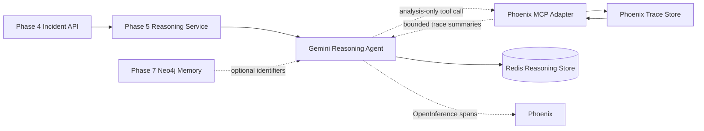

# Phase 8 -- Phoenix MCP Self-Introspection

> **Objective:** Let the reasoning agent inspect its own prior reasoning
> traces through Phoenix MCP.
>
> Phase 8 answers "Why did I reason this way before?" It does not score,
> learn from, or automatically change recommendations yet.

---

## Product Context

Existing drone platforms monitor missions. TARS is designed to learn from
missions.

Phases 1 through 7 create the facts needed for introspection:

- Phase 4 creates bounded deterministic incidents.
- Phase 5 produces advisory root-cause reasoning.
- Phase 6 traces every reasoning execution in Phoenix.
- Phase 7 connects missions, incidents, root causes, mitigations, and outcomes
  in Neo4j operational memory.

Phase 8 gives the agent an analysis-only tool for asking Phoenix about its own
reasoning history. The agent can inspect prior traces, compare decision paths,
and identify recurring reasoning patterns such as:

```text
Why do I keep misclassifying GPS failures?
```

Phoenix MCP returns bounded trace summaries. The agent studies them as
evidence. It does not rewrite history, change graph memory, run evaluations,
or issue flight commands.

---

## Scope

Phase 8 introduces a Phoenix MCP integration for trace introspection and adds
an optional self-introspection workflow to the Phase 5 reasoning layer.

Phase 8 owns:

- Phoenix trace query configuration.
- A small MCP server or MCP-compatible tool adapter for Phoenix trace search.
- Trace-summary models with strict content bounds.
- Safe lookup by mission ID, incident ID, reasoning ID, root cause, model,
  prompt version, status, and time range.
- Optional Phase 5 tool access to ask for relevant prior traces.
- Trace retrieval provenance in new reasoning outputs and spans.
- Tests proving Phoenix MCP is analysis-only and fail-open.

Phase 8 should answer:

- "Show prior failed reasoning traces for GPS-related incidents."
- "Which traces used prompt version X?"
- "What reasoning paths led to root cause Y?"
- "Have recent traces for navigation instability failed at the same stage?"
- "What prior traces are relevant to this current incident?"
- "Did the agent inspect traces before producing this recommendation?"

---

## Success Statement

Phase 8 succeeds when a reasoning request can optionally ask Phoenix for
bounded prior traces and include a clear introspection summary in the decision
context, while the produced recommendation remains advisory and Phase 5 still
works when Phoenix MCP is unavailable.

```text
Current incident
    -> Phase 5 reasoning
    -> Phoenix MCP trace search
    -> bounded trace summaries
    -> introspection notes
    -> advisory reasoning result
```

An operator should be able to see, in Phoenix, that the agent used the
trace-inspection tool and which trace identifiers influenced the analysis.

---

## Non-Goals

Phase 8 must not:

- Add Phoenix evaluations; those belong to Phase 9.
- Create metrics, scores, or accuracy labels.
- Store evaluation results.
- Create candidate or validated knowledge; those belong to Phases 10 and 11.
- Adapt recommendations from validated knowledge; that belongs to Phase 12.
- Write to Neo4j operational memory except through existing explicit Phase 7
  sync/observation flows.
- Read raw Phase 1 telemetry or unbounded Phase 3 state timelines.
- Copy full Phoenix trace bodies into Neo4j, Redis, or PostgreSQL.
- Expose arbitrary Phoenix queries or unrestricted trace export.
- Let tools execute drone commands, mutate upstream phase data, or call PX4.
- Make Phoenix MCP required for Phase 5 reasoning.
- Treat trace frequency as correctness.

Phase 8 gives the agent a mirror. It does not grade the reflection yet.

---

## Architecture



### Runtime Boundary

```text
Flight-critical path:
PX4 -> telemetry -> state -> deterministic incident detection

Analysis path:
incident -> reasoning -> optional Phoenix MCP trace introspection -> advisory result
```

Phoenix MCP, Gemini, Phoenix, and Neo4j remain off the flight-critical path.
If the MCP tool fails, times out, or returns no traces, Phase 5 continues with
incident-only reasoning.

### Component Responsibilities

| Component | Responsibility |
|-----------|----------------|
| **Phoenix MCP Config** | Load Phoenix endpoint, timeout, query limits, content mode, and enable flags. |
| **Phoenix Trace Client** | Query Phoenix for trace metadata and bounded spans. |
| **Trace Summarizer** | Convert raw Phoenix results into safe compact summaries. |
| **MCP Tool Adapter** | Expose trace search as analysis-only tools. |
| **Reasoning Tool Policy** | Decide when Phase 5 may call the introspection tool. |
| **Reasoning Integration** | Include trace summaries in prompt context without raw telemetry or secrets. |
| **Tracing Instrumentation** | Record tool calls as child spans in Phoenix. |

---

## Source-of-Truth Boundaries

| Data | Source of Truth | Phase 8 Behavior |
|------|-----------------|------------------|
| Reasoning traces | Phoenix | Query bounded trace summaries. |
| Mission and incident facts | Phase 2 / Phase 4 / Phase 7 | Use identifiers and bounded incident contracts only. |
| Current reasoning result | Phase 5 Redis | Optionally annotate with introspection metadata. |
| Operational graph history | Neo4j | Optional correlation source; do not copy trace bodies into graph. |
| Evaluation scores | Future Phase 9 | Not created in Phase 8. |

Phoenix remains the trace store. Phase 8 may cache short-lived query results
inside a request, but it should not create a durable shadow trace database.

---

## MCP Tool Contract

Expose a small set of bounded, read-only tools.

### `search_reasoning_traces`

Search Phoenix for traces matching operational identifiers or classifications.

Input:

```json
{
  "mission_id": "mission_20260608_120000",
  "incident_id": "inc_01J...",
  "incident_type": "navigation_instability",
  "root_cause": "gps_interference",
  "prompt_version": "v1.0",
  "outcome": "failed",
  "from_time": "2026-06-01T00:00:00Z",
  "to_time": "2026-06-16T00:00:00Z",
  "limit": 10
}
```

Output:

```json
{
  "traces": [
    {
      "trace_id": "abc123",
      "reasoning_id": "reason_...",
      "mission_id": "mission_...",
      "incident_id": "inc_...",
      "incident_type": "navigation_instability",
      "root_cause": "gps_interference",
      "confidence": 0.72,
      "prompt_version": "v1.0",
      "model": "gemini-2.5-flash",
      "outcome": "failed",
      "duration_ms": 1280,
      "created_at": "2026-06-15T10:30:00Z"
    }
  ],
  "total": 1,
  "truncated": false
}
```

### `get_reasoning_trace_summary`

Return a safe summary for one trace.

Input:

```json
{
  "trace_id": "abc123"
}
```

Output:

```json
{
  "trace_id": "abc123",
  "reasoning_id": "reason_...",
  "root_span": "reasoning.analyze",
  "stages": [
    {
      "name": "phase4.get_incident",
      "status": "ok",
      "duration_ms": 42
    },
    {
      "name": "gemini.generate",
      "status": "error",
      "duration_ms": 1100,
      "safe_error": "provider timeout"
    }
  ],
  "prompt_version": "v1.0",
  "model": "gemini-2.5-flash",
  "captured_content": "metadata",
  "summary": "Reasoning failed during model generation after incident retrieval."
}
```

### `compare_reasoning_traces`

Compare a small set of traces and summarize repeated patterns.

Input:

```json
{
  "trace_ids": ["abc123", "def456", "ghi789"]
}
```

Output:

```json
{
  "trace_ids": ["abc123", "def456", "ghi789"],
  "common_incident_type": "navigation_instability",
  "common_prompt_version": "v1.0",
  "repeated_failure_stage": "gemini.generate",
  "observed_pattern": "All selected traces failed during provider invocation.",
  "not_an_evaluation": true
}
```

The comparison is descriptive only. It must not return accuracy scores,
success rates, or validated lessons.

---

## Trace Content Policy

Phase 8 should retrieve enough trace context for introspection while avoiding
unbounded data exposure.

### Allowed

- Trace identifiers.
- Span names, status, timing, and safe error messages.
- TARS correlation attributes from Phase 6.
- Model, prompt version, confidence, root cause, advisory status, and outcome
  attributes.
- Bounded prompt or response snippets only when explicitly enabled for local
  development.

### Prohibited

- API keys, credentials, authorization headers, Redis URLs, Neo4j passwords,
  or environment dumps.
- Raw telemetry, mission replay timelines, or Phase 3 state timelines.
- Full prompt and response bodies in default mode.
- Arbitrary Phoenix exports.
- Full stack traces that may contain secrets.
- Any tool that mutates Phoenix, Redis, PostgreSQL, Neo4j, PX4, MAVSDK, or
  upstream APIs.

### Content Modes

| Mode | Behavior |
|------|----------|
| `metadata` | Default. Return identifiers, attributes, stage timing, and safe errors only. |
| `summary` | Return metadata plus bounded summaries generated from safe span fields. |
| `full_dev` | Local development only. May return bounded prompt/response snippets. |
| `disabled` | Disable MCP tool registration and trace queries. |

Production-like settings should use `metadata` or `summary`.

---

## Reasoning Integration

Phase 8 should make introspection optional and explicit.

### API Request

Extend the Phase 5 analyze request:

```json
{
  "overwrite": true,
  "use_introspection": false
}
```

Default `false` preserves existing Phase 5 behavior. Demonstrations can set it
to `true`.

### Prompt Context

When enabled, the reasoning service may add a bounded introspection block:

```json
{
  "introspection": {
    "source": "phoenix_mcp",
    "traces_consulted": ["abc123", "def456"],
    "summary": [
      "Two prior navigation_instability traces used prompt v1.0.",
      "One prior trace failed during provider invocation.",
      "Prior traces proposed gps_interference with moderate confidence."
    ],
    "limitations": [
      "Trace history is descriptive and not an evaluation.",
      "No accuracy labels are available in Phase 8."
    ]
  }
}
```

The prompt must explicitly say that trace history is not ground truth and must
not be treated as validation.

### Result Metadata

Extend the reasoning result only with safe provenance:

```json
{
  "introspection_used": true,
  "introspection_trace_ids": ["abc123", "def456"],
  "introspection_summary": "Prior traces showed repeated gps_interference classifications."
}
```

Do not store raw trace summaries if they contain prompt or response content.

---

## Package Layout

```text
src/
+-- tars/
    +-- phase8/
        |-- __init__.py
        |-- config.py
        |-- models.py
        |-- phoenix_client.py
        |-- summarizer.py
        |-- mcp_tools.py
        |-- service.py
        +-- tool_policy.py
```

Responsibilities:

- `config.py`: Phoenix MCP settings, limits, timeout, and content mode.
- `models.py`: tool inputs, safe trace summaries, and introspection metadata.
- `phoenix_client.py`: Phoenix trace query client.
- `summarizer.py`: raw trace-to-safe-summary conversion.
- `mcp_tools.py`: MCP tool registration and schemas.
- `service.py`: orchestration for trace search and comparison.
- `tool_policy.py`: rules for when Phase 5 may call introspection.

Phase 5 should depend only on a small Phase 8 service/tool interface. It must
not construct Phoenix queries directly.

Tests:

```text
tests/
+-- phase8/
    |-- __init__.py
    |-- conftest.py
    |-- test_config.py
    |-- test_models.py
    |-- test_summarizer.py
    |-- test_phoenix_client.py
    |-- test_mcp_tools.py
    |-- test_tool_policy.py
    +-- test_reasoning_integration.py
```

---

## Configuration

Add Phase 8 environment settings:

```text
PHOENIX_MCP_ENABLED=false
PHOENIX_MCP_ENDPOINT=http://localhost:6006
PHOENIX_MCP_TIMEOUT_SECONDS=5.0
PHOENIX_MCP_CONTENT_MODE=metadata
PHOENIX_MCP_DEFAULT_LIMIT=5
PHOENIX_MCP_MAX_LIMIT=20
PHOENIX_MCP_MAX_TRACE_IDS=10
PHOENIX_MCP_MAX_SUMMARY_CHARS=2000
PHOENIX_MCP_ALLOW_FULL_DEV_CONTENT=false
```

Recommended behavior:

- Disabled by default.
- Invalid content mode fails configuration tests and disables tool
  registration at runtime.
- Phoenix unavailable logs a warning and returns an empty introspection result.
- Timeouts should be short because introspection is advisory context only.

If a hosted Phoenix deployment is used, credentials must come from environment
variables and must never be included in trace summaries.

---

## Failure Handling

| Failure | Expected Behavior |
|---------|-------------------|
| Phoenix MCP disabled | Phase 5 behaves exactly as before. |
| Phoenix unavailable | Return empty introspection and continue reasoning. |
| Phoenix query timeout | Record timeout in tool span; continue without traces. |
| No relevant traces found | Continue with incident-only reasoning. |
| Malformed Phoenix response | Drop malformed trace item, log safe warning, continue. |
| Trace summary exceeds bounds | Truncate and mark `truncated=true`. |
| Tool returns unsafe content | Reject content and continue without that trace. |
| MCP tool call fails inside Gemini/ADK | Record failure span; preserve original reasoning behavior. |
| Prompt context grows beyond budget | Keep top-ranked trace summaries and mark omitted count. |
| Phoenix credentials missing | Report disabled or unavailable; do not crash Phase 5 startup. |

Tool failures must never hide Gemini, validation, Redis, or Phase 4 errors.

---

## Testing Strategy

Automated tests must not require live Phoenix, live Gemini, or MCP network
services. Use fake Phoenix clients and fake tool calls.

### Configuration Tests

- Disabled by default.
- Supported content modes load correctly.
- Limits and timeouts are bounded.
- Invalid content mode is rejected or disables tool registration safely.
- Full development content requires explicit opt-in.

### Model Tests

- Tool request models enforce positive limits.
- Limit values are capped to configured maximums.
- Trace summaries require trace IDs and safe status fields.
- Unsafe or overlong summaries are truncated.
- Comparison output includes `not_an_evaluation=true`.

### Phoenix Client Tests

- Builds bounded trace search queries from TARS attributes.
- Handles `404`, `5xx`, timeout, and malformed response safely.
- Does not include credentials in exceptions or returned summaries.
- Does not request raw telemetry, replay frames, or unrestricted trace bodies.

### Summarizer Tests

- Converts spans into compact stage summaries.
- Preserves mission, incident, reasoning, model, prompt version, and status.
- Redacts secret-like fields.
- Truncates prompt/response snippets according to content mode.
- Drops unsafe span attributes.

### MCP Tool Tests

- Registers only read-only Phoenix tools.
- Rejects arbitrary query strings.
- Enforces trace ID and result limits.
- Returns empty results when disabled.
- Marks comparison output as descriptive, not evaluative.

### Reasoning Integration Tests

- Existing Phase 5 tests pass when introspection is disabled.
- `use_introspection=false` never calls Phoenix MCP.
- `use_introspection=true` adds bounded introspection context.
- Phoenix MCP failure does not fail reasoning.
- Tool calls are traced as child spans.
- Reasoning result records `introspection_used` and consulted trace IDs.
- Prompt warns that trace history is not ground truth.

### Regression Tests

- Existing Phase 2 through Phase 7 behavior remains unchanged.
- No test requires PX4, Phoenix, Gemini, Neo4j, or live upstream APIs.
- No raw telemetry, credentials, or full trace bodies appear in test outputs.

---

## Implementation Sequence

### Step 1 -- Define Tool Contract and Safety Policy

- Define the read-only Phoenix MCP tools.
- Define trace-search filters and query limits.
- Define safe trace-summary fields.
- Document content modes and prohibited data.
- Add Pydantic request/response models.

### Step 2 -- Add Configuration and Summarization

- Add Phase 8 settings.
- Implement trace-summary truncation and redaction.
- Implement descriptive comparison summaries.
- Add model, config, and summarizer tests.

### Step 3 -- Implement Phoenix Trace Client

- Query Phoenix by TARS trace attributes from Phase 6.
- Support search by mission, incident, reasoning ID, incident type, root cause,
  prompt version, outcome, and time range.
- Return bounded metadata-first results.
- Handle Phoenix failures fail-open.
- Add fake-client tests.

### Step 4 -- Implement MCP Tool Adapter

- Register `search_reasoning_traces`.
- Register `get_reasoning_trace_summary`.
- Register `compare_reasoning_traces`.
- Enforce read-only behavior and no arbitrary query execution.
- Add MCP tool tests.

### Step 5 -- Integrate With Phase 5 Reasoning

- Extend `AnalyzeRequest` with `use_introspection=false`.
- Add a narrow Phase 8 service interface to Phase 5.
- When enabled, fetch relevant traces using current mission/incident/type.
- Add bounded introspection context to the prompt.
- Persist safe introspection metadata on the reasoning result.
- Record MCP tool calls as child spans in Phase 6/Phoenix.

### Step 6 -- API Lifecycle and Health

- Initialize Phase 8 tooling during Phase 5 startup when enabled.
- Flush or close any Phoenix client resources during shutdown.
- Extend Phase 5 health with `phoenix_mcp`: `ok`, `disabled`, or
  `unavailable`.
- Ensure unavailable MCP does not make Phase 5 unhealthy.

### Step 7 -- Documentation and Demonstration

- Update `.env.example`, `requirements.txt`, and README.
- Document how to enable Phoenix MCP locally.
- Document safe content modes.
- Demonstrate one reasoning request without introspection.
- Demonstrate one reasoning request with introspection using prior traces.
- Show in Phoenix that the introspection tool call was traced.

### Step 8 -- Verification

- Run Phase 8 tests.
- Run Phase 5, Phase 6, Phase 7, and full regression suites.
- Confirm Phase 5 still works with Phoenix MCP disabled.
- Confirm Phase 5 still works when Phoenix is stopped.
- Confirm no raw telemetry, credentials, or full trace bodies are returned.
- Confirm no evaluation scores or learned knowledge are created.

---

## Acceptance Criteria

Phase 8 is complete when:

1. Phoenix trace search is exposed through bounded read-only MCP tools.
2. Trace summaries include mission, incident, reasoning, prompt, model,
   status, timing, and safe error context.
3. Phase 5 can run with introspection disabled and behaves as before.
4. Phase 5 can optionally use introspection for a reasoning request.
5. Phoenix MCP failures do not prevent incident reasoning.
6. Introspection tool calls are visible as child spans in Phoenix.
7. Reasoning results record whether introspection was used and which trace IDs
   were consulted.
8. The prompt clearly states that trace history is descriptive, not validated
   ground truth.
9. The MCP integration exposes no arbitrary query, write, or flight-control
   capability.
10. No raw telemetry, credentials, or unbounded trace content is returned.
11. No evaluation scores, candidate knowledge, or validated knowledge are
    created.
12. Automated tests run without live Phoenix, Gemini, Neo4j, PX4, or upstream
    APIs.
13. Existing Phase 2 through Phase 7 behavior remains unchanged.

---

## Deliverables

- `plans/phase-8-phoenix-mcp.md`.
- `src/tars/phase8/` Phoenix MCP/self-introspection package.
- Bounded read-only Phoenix trace tools.
- Optional Phase 5 `use_introspection` request path.
- Safe introspection prompt context and result metadata.
- Tool-call tracing through Phase 6/Phoenix.
- Phase 8 unit, tool, client, summarizer, and reasoning-integration tests.
- Updated dependency, environment, README, and demo documentation.

---

## Phase 9 Handoff

Phase 8 produces descriptive introspection evidence. Phase 9 turns reasoning
quality into measured evaluations.

The handoff should preserve:

- Trace IDs consulted during reasoning.
- Reasoning IDs and prompt versions.
- Root-cause and recommendation outputs.
- Safe tool-call metadata.
- Clear labels that Phase 8 summaries are not evaluation scores.

Phase 9 can then attach explicit quality metrics without confusing trace
inspection with correctness.
